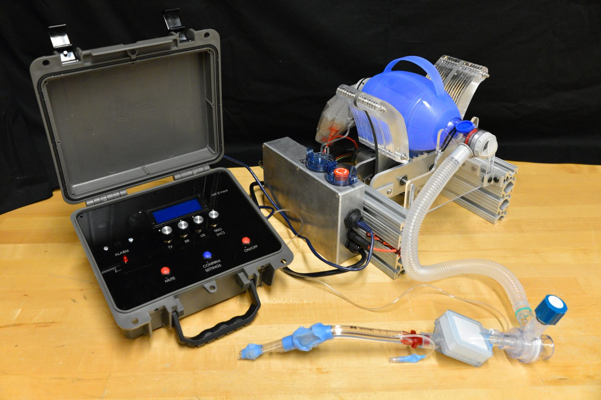

# Version 3 MIT Emergency Ventilator (E-Vent) Project

### References: 

All the information compiled here is from the [MIT Emergency Ventilator (E-Vent) Project](https://e-vent.mit.edu/)

To download our repo: [**DOWNLOAD**](https://github.com/CombatCovid/mit-emergency-ventilator/archive/version_3.zip)

This is the url of our repo : [https://github.com/CombatCovid/mit-emergency-ventilator](https://github.com/CombatCovid/mit-emergency-ventilator)

See it working here : [VentPumping-compressed.mp4](https://e-vent.mit.edu/wp-content/uploads/2020/04/VentPumping-compressed.mp4)

## Goal
The goal of this site is to provide the best information we can, focused around safety, on automating a manual resuscitator, as a potential means for longer-term ventilation. This is a completely off-label use, but we recognize the global interest when a hospital has used up all ventilators and the only option is manual bagging a patient. We hope that such systems may serve as bridge devices and help with the triage of available respirators and clinicians trained in respiratory therapy. This may allow less severe patients to be cared for by less specialized clinicians, while resources are focused on those most in need. However, at no time should a patient be unattended without someone skilled available to directly monitor their vital signs. Effectively, we are reprising the early days of safe ventilation where direct clinical observation of patient condition served as the key feedback.

Begin by reading the [Key Ventilation Specifications](03-Key-Ventilation-Specifications.md), then the detailed clinical information. This is critical to understand the logic underlying the mechanical, electrical, controls and testing information. 

## Background & Need

We are one of several teams who recognized the challenges faced by Italian physicians, and are working to find a solution to the anticipated global lack of ventilators. In the US alone, the COVID-19 pandemic may cause ventilator shortages on the order of 300,000-700,000 units (CDC Pandemic Response Plans). These could be present on a national scale within weeks, and are already being felt in certain areas. An increase in conventional ventilator production is very likely to fall short and with significant associated cost (paywall warning).

Almost every bed in a hospital has a manual resuscitator nearby, available in the event of a rapid response or code where healthcare workers maintain oxygenation by squeezing the bag. Automating this appears to be the simplest strategy that satisfies the need for low-cost mechanical ventilation, with the ability to be rapidly manufactured in large quantities. However, doing this safely is not trivial.

Use of a bag-valve mask (BVM) in emergency situations is not a new concept. A portable ventilator utilizing a manual resuscitator was introduced in 2010 by a student team in the MIT class 2.75 Medical Device Design (original paper here and news story here), but did not move past the prototype stage. Around the same time, a team from Stanford developed a lower-cost ventilator for emergency stockpiles and the developing world. 

It looks similar to a modern ICU ventilator (Onebreath), but “production for US hospitals would start in  about 11 months”, making it “a second wave solution” (MIT Tech Review Article). Last year, the concept was re-visited by two student teams, one from Rice university , and another Boston-based team who won MIT Sloan’s Healthcare prize (MIT News: Umbilizer). Other teams currently working on this challenge can be found linked on our Resources page.

## MIT Emergency Ventilator (E-Vent) Project

MIT E-Vent Version 3 showing control box and full setup
Goal
The goal of this site is to provide the best information we can, focused around safety, on automating a manual resuscitator, as a potential means for longer-term ventilation. This is a completely off-label use, but we recognize the global interest when a hospital has used up all ventilators and the only option is manual bagging a patient. We hope that such systems may serve as bridge devices and help with the triage of available respirators and clinicians trained in respiratory therapy. This may allow less severe patients to be cared for by less specialized clinicians, while resources are focused on those most in need. However, at no time should a patient be unattended without someone skilled available to directly monitor their vital signs. Effectively, we are reprising the early days of safe ventilation where direct clinical observation of patient condition served as the key feedback.

Begin by reading the Key Ventilation Specifications, then the detailed clinical information. This is critical to understand the logic underlying the mechanical, electrical, controls and testing information. We have just posted essential safety information on removing dead space.

## Background & Need
We are one of several teams who recognized the challenges faced by Italian physicians, and are working to find a solution to the anticipated global lack of ventilators. In the US alone, the COVID-19 pandemic may cause ventilator shortages on the order of 300,000-700,000 units (CDC Pandemic Response Plans). These could be present on a national scale within weeks, and are already being felt in certain areas. An increase in conventional ventilator production is very likely to fall short and with significant associated cost (paywall warning).

Almost every bed in a hospital has a manual resuscitator nearby, available in the event of a rapid response or code where healthcare workers maintain oxygenation by squeezing the bag. Automating this appears to be the simplest strategy that satisfies the need for low-cost mechanical ventilation, with the ability to be rapidly manufactured in large quantities. However, doing this safely is not trivial.

Use of a bag-valve mask (BVM) in emergency situations is not a new concept. A portable ventilator utilizing a manual resuscitator was introduced in 2010 by a student team in the MIT class 2.75 Medical Device Design (original paper here and news story here), but did not move past the prototype stage. Around the same time, a team from Stanford developed a lower-cost ventilator for emergency stockpiles and the developing world. It looks similar to a modern ICU ventilator (Onebreath), but “production for US hospitals would start in about 11 months”, making it “a second wave solution” (MIT Tech Review Article). Last year, the concept was re-visited by two student teams, one from Rice university, and another Boston-based team who won MIT Sloan’s Healthcare prize (MIT News: Umbilizer). Other teams currently working on this challenge can be found linked on our Resources page.

## Key Research Question 

We have launched an emergency research project with a team of MIT Engineers and American clinicians to address the question:

Is it possible to safely ventilate a COVID-19 patient by automatically actuating a manual resuscitator?

Our process in approaching this question is to first identify the minimum requirements for a low-cost ventilator, based on the collective wisdom of many clinicians; design against these requirements; conduct immediate testing; report the results; iterate and facilitate discussion.

Manual ventilation is a short-term solution in a critical care environment, without any apparent clinical evidence regarding the safety of long-term use (days-weeks). There are multiple scenarios in which respiratory support could be needed: patients can be awake or asleep, sedated or sedated and paralyzed, breathing spontaneously, weaning off of a vent, etc. Furthermore, changing clinical presentations with ARDS require shifting minute ventilation (tidal volume X respiratory rate) to “lung-protective” strategies, which place patients at risk for things like auto-PEEP. Some of these situations are simpler than others, with the simplest being ventilating a sedated, paralyzed patient. In such a situation, at a minimum a safe emergency ventilator could be used to free-up a conventional ventilator.

Any solution should be utilized only in a healthcare setting with direct monitoring by a clinical professional. While it cannot replace an FDA-approved ICU ventilator, in terms of functionality, flexibility, and clinical efficacy, the MIT E-Vent is anticipated to have utility in helping free up existing supply or in life-or-death situations when there is no other option.

Further, any low-cost ventilator system must take great care regarding providing clinicians with the ability to closely control and monitor tidal volume, inspiratory pressure, bpm, and I/E ratio, and be able to provide additional support in the form of PEEP, PIP monitoring, filtration, and adaptation to individual patient parameters. We recognize, and would like to highlight for anyone seeking to manufacture a low-cost emergency ventilator, that failing to properly consider these factors can result in serious long-term injury or death.