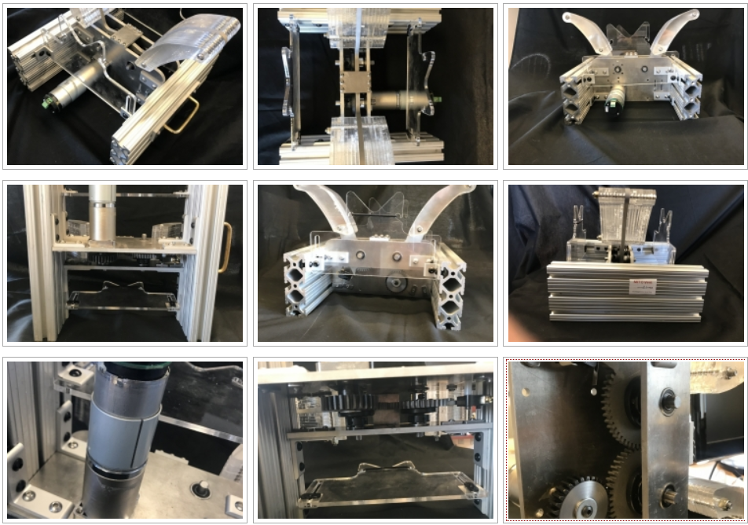

# How to use the BOM for Version 3 of E-Vent

1.  The new design in a nutshell is shown here:

2. Source files for mechanical design:

- [CAD files](../../src/3.1-STEP-and-DXF): with help from Neal Drapeau
- Mechanical BOM: [Spreadsheet](../../src/Mechanical-BOM_20200404.xlsx)

3. Access the code from GitHub, [in the e-vent repo](https://github.com/mit-drl/e-vent)

4. Two design tools that will allow you to explore different gear configurations and select appropriate motors:

    - [Gear Stress Estimator Spreadsheet](../../src/E-Vent-gear-stress-calculations.xlsx) 

        This is designed to calculate the maximum bending stress experienced by gear teeth. This should be compared to stress – fatigue curves for a given candidate material.

    - [Gear Torque and Speed Estimator Spreadsheet](../../src/E-Vent-gear-torque-and-speed-calcuations.xlsx)

         Purpose: This outputs the torque and speed required by the driven arm and the pinion. The radial load from the pinion on the gearbox shaft is also calculated. The speed and torque results should help you select and appropriate motor, based on comparing these to a given motor’s curves.

5. Source files for circuit diagram:

- KiCad project: [Source files](../../src/eventArduinoMega) , and [Gerber files](../../src/arduinoMegaEVentGerber)
- Electrical BOM: [Spreadsheet](../../src/Electronics-BOM_20200410.xlsx)

6. Past Designs

 - More details are available in [Past Designs](https://e-vent.mit.edu/mechanical/past-designs/).