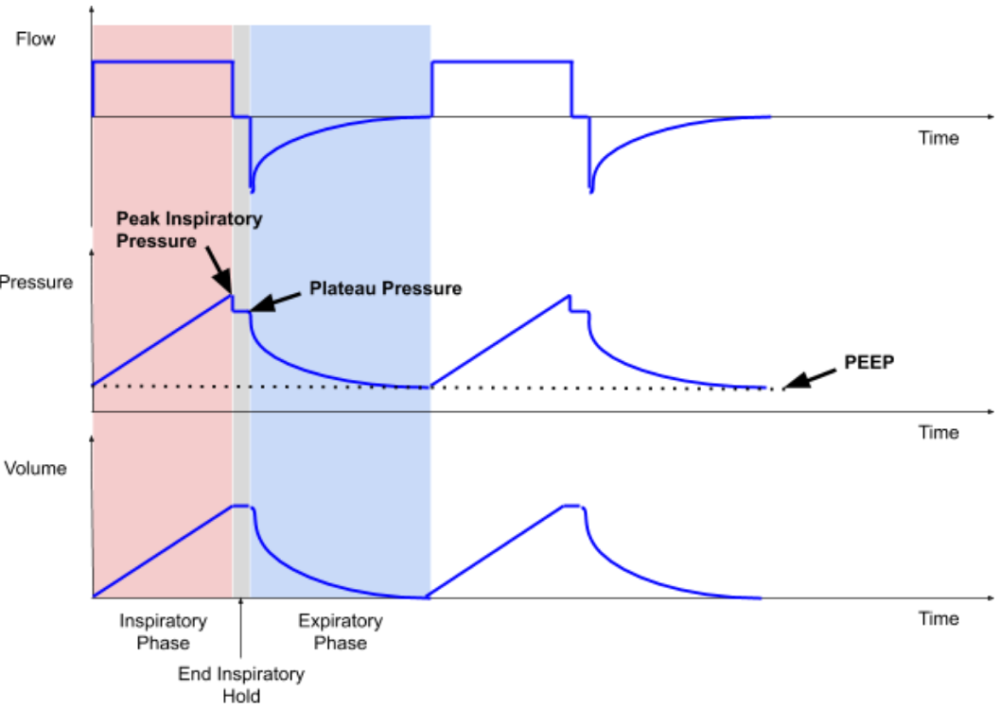
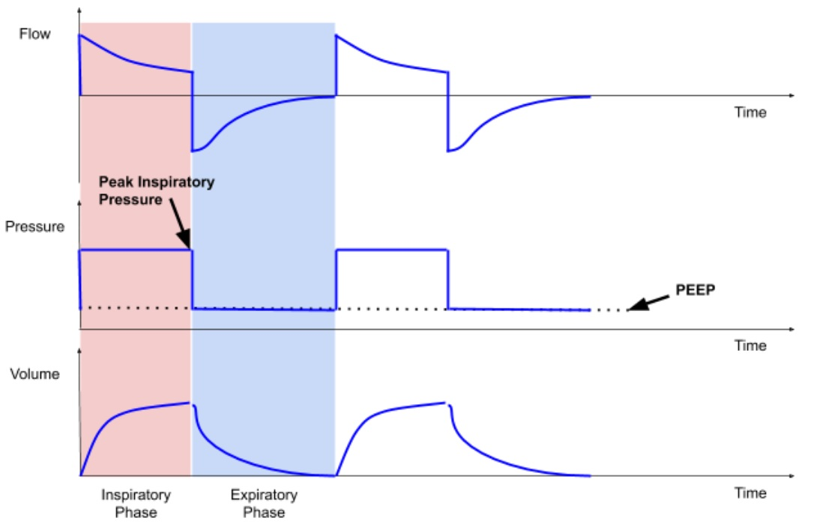

# Clinical studies

**This section guides the engineering design with a focus on safety.**

**Caution: This section MUST be read and understood fully first. No engineering team should consider designing a ventilator without a clinician experienced in mechanical ventilation and respiratory management involved.**

The MIT E-Vent is intended for emergency use only when all available conventional invasive respiratory support has been exhausted. It should only be used in a clinical environment under careful monitoring by trained medical professionals. 

This has been developed by a team of physicians certified in Anesthesia and Critical Care, working with mechanical, electrical, and software engineers. There were two critical tasks which we started with:

1. Identify potential use scenarios
2. Define the minimum safe clinical functional requirements (specs)

To minimize time to bedside without compromising patient safety, the clinical functional requirements were distributed to a broad team of clinical advisors. 

In parallel, a peer-review process was used to identify what was felt to be the best design concept (in spirit, loosely based on a prior student project which was not clinically validated). Once a review of the clinical functional requirements was completed, it was distributed to the design and controls teams.

We hope that this website can act as a reference point to help others and encourage discussion. Also, it is intended as a resource for makers or manufacturers to access and utilize the latest design. As it stands, several important tasks remain:

1. FDA review and feedback, work towards approval
2. Long-term (days) porcine trials
3. Implement design for manufacturing
4. Logistics for manufacture, distribution, and quality controls

## Anticipated Clinical Scenarios

Specific to the present COVID-19 pandemic, we anticipate the following scenarios in which an emergency mechanical ventilator could be safely used to provide respiratory support:

- A deteriorating COVID-19 patient, who is short of breath & hypoxic; hypoxemic respiratory insufficiency means they are not breathing well enough to adequately oxygenate their blood. Clinicians at this point can initiate respiratory support. An MIT E-Vent could provide basic respiratory support in this situation
- Worsening clinical status recognized when a patient develops Acute Respiratory Distress Syndrome (ARDS). An MIT E-Vent could be a bridging solution until a traditional ICU ventilator becomes available
- The patient will be intubated or have a tracheostomy (limited / no applicability to mask)
- Those patients are otherwise going to be sedated and paralyzed (invasive ventilation requires sedation, and paralysis will prevent patient-ventilator dyssynchrony if assist-control is not available)
- Ventilated patients required to leave the ICU for imaging or procedures can be supported with the MIT E-Vent, unless determined that the patient requires support outside its range.
- A multidisciplinary team consisting of a physician, critical care nurse, and respiratory therapist should be available to monitor ventilated patients at all times. Additionally, a clinical lab capable of timely reporting of blood gases and other common ICU laboratory markers should be available to enable the clinical team to make appropriate decisions and adjustments.

## Acute Respiratory Distress Syndrome

Those patients with ARDS would preferentially receive mechanical ventilation by standard ICU ventilators. A manual resuscitator is meant as a backup should institutions run out of traditional ventilators, and for patients with milder forms of lung disease that require less sophisticated modes and features.

Changes in lung mechanics (compliance) can be a result of acute and chronic lung conditions. In general, lung compliance is affected by a multitude of factors; in ARDS, fluid is present in the alveoli and/or interstitial space (between the alveoli and a capillary blood vessel) and results in changes in the diffusion of gases between the alveoli and blood vessel. Other conditions include:

- Any pathologies that cause fluid accumulation in the lung (‘wet lung’) through infectious, inflammatory, mechanical, or hydrostatic factors (pulmonary edema, TRALI, pneumonia, pneumonitis, diffuse alveolar hemorrhage, heart failure, cardiogenic shock, mitral valve regurgitation)
- Any pathology that causes fibrosis (scarring and thus stiffening – ‘stiff lung’) of the lung structure, otherwise known as the “parenchyma” (ARDS related, interstitial lung disease, sarcoidosis, idiopathic pulmonary fibrosis, radiation or chemotherapy-related, post pneumonia or hemothorax related trapped lung or lung fibrosis)

The safe limit for ventilation therapy has not yet been determined. In the life-and-death situation we are currently facing, this will give patients a chance until an ICU or OR ventilator becomes available. We are actively engaging with animal testing laboratories to determine what, if any, these limitations may be. Further, we plan to perform multi-day trials in pigs to evaluate the safety of longer-term MIT E-Vent use.

## Clinical Mechanical Ventilation 101

If we boil down how a modern ICU ventilator works, there are three important parameters.

- Tidal volume (air delivered to the patient)
- Inspiratory phase start (“triggering”)
- Expiratory phase start (“cycling”)

Each of these values is first determined by the machine and healthcare operator. Adjustments are made in real-time to optimize the patient’s clinical status, as measured by checking lab draws and monitoring vital signs. The patient acts as a “built-in” sensor!

## Tidal Volume: Volume-Control vs. Pressure-Control

- Tidal volume, one can set a specific volume in milliliters or set an inspiratory pressure on the mechanical ventilator; tidal volume is often discussed and thought about as a value based on cc/kg of ideal body weight (see Equation 1).  
- In Acute Respiratory Distress Syndrome (ARDS), patients’ tidal volumes are kept between 4 to 8 cc/kg.  Here is a convenient chart (PDF) provided by ARDSNet with values for ideal or predicted body weight and different tidal volumes corresponding to the patient’s height.

Equation 1. Gender-specific formulas to calculate ideal body weight (courtesy: ARDSNet):

- Male Ideal Body Weight (kg) = 50 +[0.91 (height in cm – 152.4)]
- Female Ideal Body Weight (kg) = 45.5 +[0.91 (height in cm – 152.4)]

Volume control mode is just that: a clinician defines the tidal volume, see @fig:tidal-volume. The machine will then try to deliver that volume with a uniform inspiratory flow rate, over a specified inspiratory time (see discussion on cycling). 
This is done regardless of how much pressure builds up in the lungs, referred to as peak inspiratory pressure (PIP). Modern ventilators have safety features to limit max pressures, which can result in damage to the lungs (a.k.a. barotrauma).  Ventilators have the capability to perform an “end-inspiratory hold”, for a programmable duration over which the pressure in the circuit is recorded.  This is called plateau pressure ($P_{plat}$). A volume-controlled breath cycle with inspiratory hold is illustrated in @fig:tidal-volume.

{#fig:tidal-volume}

Pressure control mode utilizes pressure supplied by the ventilator, and the patient’s lung compliance and inspiratory time determine the volume of gas delivered (tidal volume), see @fig:tidal-volume-2. 

As we are actively learning more about patients with COVID-19, what we do know is that there is an [ARDS-like](https://www.thelancet.com/journals/lanres/article/PIIS2213-2600(20)30079-5/fulltext) clinical picture. Therefore we know that in COVID-19 patients, the lung compliance changes with the disease course, and thus tidal volume will change with long-term use of pressure control ventilation.

{#fig:tidal-volume-2}

This presents another branch point for granular clinical details: **compliance** can be further broken down into that of the upper and lower airways, see @fig:anatomy. 

The upper airway consists of some structures bypassed by something like an endotracheal tube, namely the mouth, nose, oropharynx, and trachea. The lower airway consists of the bronchi (left and right mainstem, which further branches into secondary and tertiary bronchi, bronchioles, and alveoli). Compliance is also affected by the type of lung disease, grouped into restrictive or obstructive types, each further divided into extrinsic and intrinsic types. COVID-19 patients who develop ARDS have an intrinsic, restrictive disease which requires additional baseline pressure to help “prop” open alveoli to maintain gas exchange. This is achieved by positive end-expiratory pressure (PEEP).

{#fig:anatomy}

**Inspiratory phase start: time / pressure / flow triggering**

Inspiratory phase can either be set to start at a regular interval by locking in a constant respiratory rate (e.g. time triggering) or have the ventilator sense the patient’s native inspiratory effort (with a pressure or flow sensor on the circuit), and time the start of the inspiratory phase according to the patient’s effort. This is analogous to oxygen pulse devices used by acrobatic plane pilots. Modern ICU ventilators can be set to trigger based on thresholds of flow (e.g. 1–4 L/min) or pressure (e.g. -1 to -5 cm H20) to initiate breaths. These are either inherent to a specific built-in ventilation mode (SIMV, PS, CPAP, etc; outside the present scope), or set by the clinical operator (respiratory therapist, nurse, CRNA, physician, etc). 

Here, it should be noted that there is a difference between ICU ventilators and OR ventilators: ICU ventilators tend to be more advanced and are designed to care for patients who may require support for days, or weeks. OR ventilators are simpler and generally used on healthier patients for shorter periods of time (minutes to hours). 

**Expiratory phase start: time / volume / flow / pressure cycling**

The start of the expiratory phase can be determined by different variables: time, volume, flow, and pressure.  Inspiratory phase duration can be programmed and expiration starts immediately after the time for inspiration is complete; this is called “time cycling.” In volume control, inspiration stops after the target inspiratory volume has been delivered; this is called “volume cycling.”  When inspiratory flow can be sensed, mechanical ventilator breath can switch from inspiration to expiration when the inspiratory flow reaches 10–25% of peak inspiratory flow; this is called “flow cycling.” Lastly, inspiration can be cycled into exhalation when a threshold pressure is reached.  For instance, if a patient coughs and becomes asynchronous with the ventilator, the airway pressure increases dramatically. This can be dangerous to the patient as ventilation is not effective when the patient is “fighting the vent.”  In this state, the ventilator switches inspiration to the exhalation phase and usually concurrently triggers the high-pressure alarm. This is called “pressure cycling.”

Additionally, in considering a single breath “cycle”, the ratio of time spent breathing in (inspiratory) vs. exhaling (expiratory) is important to consider as more time is required to fully exhale and prevent over-inflation (i.e. breath stacking or auto-PEEP). Inspiratory phase duration can be adjusted by altering the inspiratory to expiratory (I:E) ratio on the ventilator when a specific respiratory rate (bpm) is being used. 

**Positive end-expiratory pressure (PEEP)** is applied in order to maintain an ‘open lung’, prevent alveolar collapse and thus improve gas exchange and minimize atelectrauma (repeated opening and collapse of alveoli “atelectasis” can also cause damage; the result of which is referred to as atelectrauma). In addition, due to the inhomogeneity of the lung tissues, positive pressure ventilation may lead to regional overdistention of alveoli (volutrauma and barotrauma), which can impair gas exchange and possibly further injure the diseased lung. The regional differences in lung compliance are dynamic and significantly change throughout a patient’s hospital course. 

Depending on whether the patient or the machine determines each of the above parameters, different ventilatory modes are created.  Some examples include volume control, pressure control, assist control, pressure support, SIMV, and spontaneous modes. Full-feature ICU ventilators have other ventilatory modes available that better serve longer-term mechanical ventilation strategies. 

### Minimum Parameter Set

An automated mechanical ventilator should initially operate in volume control mode, with an initial rate, adjusting minute ventilation as the patient’s homeostasis is optimized with vital signs and lab draws. We envision two versions:

1. Volume Control: closed-loop delivery of a given tidal volume; closed-loop implies airway pressure sensing use for safety.
2. Assist Control: the system will sense airway pressure fluctuations, and supports patient-initiated breaths, and then recognizes and allows exhalation.

In the simplest implementation, the system will be tuned using direct clinical observation and laboratory studies. This can serve as a transient device (e.g. for transport or bridge to more advanced ventilator) or as a definitive ventilator once demand outpaces available resources.

The minimum required hospital-supplied components are below, and harnesses existing infrastructure to increase scale-ability:

1. Manual resuscitator “Ambu” bag: different configurations; it is recommended that a pop off (pressure release) valve and PEEP valve (listed in alphabetical order, with no preference given for any model) are included in any circuit. Suggested models include:
    - Ambu SPUR II Disposable Resuscitator (need to purchase PEEP valve adapter separately)
    - CareFusion AirLife Adult Disposable Self Inflating Resuscitation Device (need to buy PEEP valve adapter separately)
    - Teleflex Lifesaver Disposable Manual Resuscitator (Catalog #5374; pop-off valve and PEEP included)
    - VBM Germany PVC Resuscitator Set (40 cm H2O pop off valve and PEEP valve included)
2. PEEP valve can be purchased separately if needed:
    - Ambu PEEP Valves
    - CareFusion AirLife Adjustable PEEP Valves
3. Endotracheal (ET) and/or Tracheostomy tubes:
    - Follows ISO standards and have standardized connectors
4. Proper breathing circuit with proper valve mechanism at the patient end to minimize dead space and rebreathing of CO2
5. Short flexible connector to connect end of breathing circuit to ET/trach
    - AirLife Omni-Flex Patient Connector
6. Oxygen / Air mixer if available (to adjust FiO2)
7. HEPA filter to remove virus particles from expired gases (optional; likely not required if patient is in isolation).
    - Thermovent HEPA Low Deadspace Heat and Moisture Exchange Filter
