# Mechanical 

Updated 15 April 2020

This section documents the mechanical design of the MIT E-Vent.

**Note: Any mechanical design must meet the specifications outlined in the Key Ventilation Specifications section.**

We are in process of continually testing and refining our prototypes to increase robustness. The basic concept consists of two arms that gently close in sync to compress the bag. This must be coupled with a closed loop control system. Major mechanical design requirements include:

- Be nice to your bag and its hoses – Up to 7 day X 24 hour X 60 minute X 30 bpm X 2 stroke = 604,800 cycles will be needed for 7 day usage. Any design must secure the bag and gently grasp and squeeze it from both sides to reduce the risk of material fatigue. The grippers must be smooth and shaped to maximise air expelled without damaging the bag. The bag must be supported with flexibility to allow motion during operation.
- Fail-Safe operation – If the machine fails, a clinician must be able to immediately shut down, open the device manually, remove the bag and convert to manual bagging.
- Keep It Simple – Empower and support others to fabricate. We are focusing on the lowest specification system and open-souring our design information for adaptation to local supply chains.
- Multiple drive motor and sensing possibilities! Enable multiple configurations to meet local supply chain capabilities.
The overall dimensions and operation are now set and any skilled mechanical designer will be able to execute this design and adjust it to suit locally available materials and fabrication technologies. We have ready access to waterjet and laser cutters and 80/20 components, however we are now focusing on designs that can be CNC milled, stamped, molded, welded and bolted as per your supply chain and capability.

Version 3.1 herein is our most recent prototype design. Older prototypes are available in Past Designs.

**Version 3.1 – Testing / Pre-Production**

- Big gear (bottom of arms): 16 pitch, 48 tooth, 3 in. pitch dia., 14.5° pressure angle, 0.25 in thick.
- Pinion dear (driving): 16 pitch, 30 tooth, 1.875 in. pitch dia., 14.5° pressure angle. 0.5 in thick – this is to accommodate axial misalignment with the arms’ gears.
- Gear ratio: 1.6 (arm/pinion)
- Based on the estimated torque ($\tau$) of 10 N-m per arm, given in Power Calculation, divided by the gear ratio, we arrive at 12.5 N-m applied to the pinion of diameter (d) 0.0476 m (1.875 in) with pressure angle ($\phi$) of 14.5° the net radial load (F) on the pinion is given by: F = 2$\tau$/(cos($\phi$)d) = 2*12.5/(cos(14.5)0.0476) = 550 N.
- Also, for a handy diagram see Engineer’s Edge.
- This radial load is applied to the pinion approximately 2 cm from the face of the gearbox which results in a bending force on the on the gearbox shaft that must be withstood by the gearbox bearings. Consult your motor manufacturer.
- We have created a Gear Torque and Speed Estimator Spreadsheet, available in src folder.
- Material choice is extremely important – we prototyped, based on the materials readily available in the shop. Arm gear and driving pinion life must be checked for wear and fatigue, as a function of your material selection and width of parts. (Note: this is an oscillating load with force on the in stroke, while the return stroke is nearly unloaded.)
- Aluminium is not recommended. We recommend steel gears, but not stainless as this will gall/spall. Hardening the steel gears and adding lubrication will increase life.
- We have created a Gear Stress Estimator Spreadsheet, available in src folder.

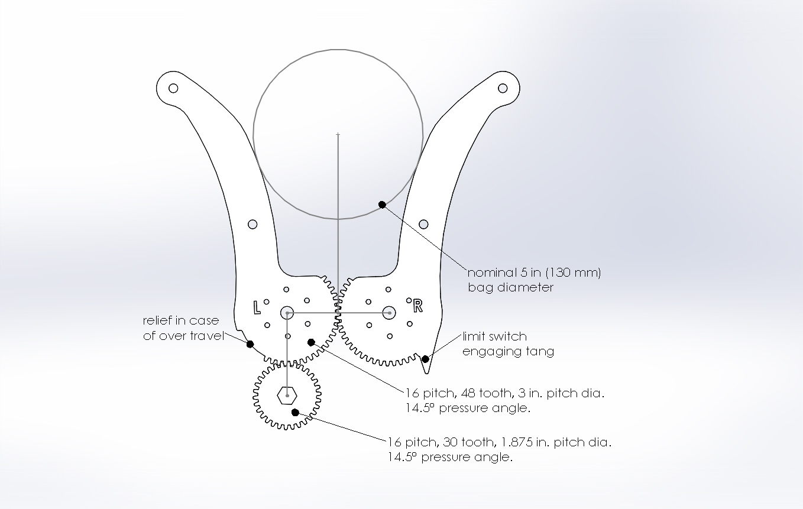

## Power Calculation

Updated 13 April 2020

This page provides an estimate of the maximum power required by a motor used to compress an Ambu bag using a double gripper design, actuated from the bottom. Different designs, with other actuation methods, will change motor specifications, but the power should stay approximately the same.

Caution: Many designs circulating on the internet significantly underestimate the pressures needed to inflate a subject’s lungs. There is a reason why the diaphragm is a large muscle. However, adding more power without great care is equally dangerous. In addition, COVID-19 compromised patients may require more aggressive motion profiles, i.e. short, quick breaths and longer exhalation times. In specific, clinicians are reporting I:E ratios of 1:4 in COVID-19 patients. (Our estimates use 1:4.)

### Theoretical Power Requirement

Independent of the mechanical design of the gripper, the required power output can be computed from the worst-case values of the following variables:

Maximum pressure at airway: P$_{airway,max}$ = 40 cm H$_2$O (pop off cracking pressure)
Maximum respiration rate: RR$_{max}$ = 40 bpm
Minimum inhale/exhale ratio of 1:4: IE$_{ratio, min}$ = 4
Maximum volume output: V$_{max}$ = 800 cm$^3$

That is, in the worst case the device needs to squeeze of air at a pressure of 40 cm H$_{2}$O , in a 0.3 second t$_{inhale}$ = 60 sec / RRmax / (1 + IE$_{ratio, min}$)).

The volumetric flow rate needed in the worst-case (peak) scenario is (@eq:volum-flow-rate-worst), then:

$$ Q_{airway} = V_{max}/t_{inhale} = 0.0027 m{^3}/s $$ {#eq:volum-flow-rate-worst}

The power output (in the form of pressurized volume flow in the airway) is:

$$ Power_{airway} = P_{airway,max}$$
 
 $$ Q_{airway} = 10.46 W $$

 However, some of the power used for squeezing the bag is lost (bag deformation, friction, etc.) and let’s estimate that 50% is converted to pressurized volume flow. Taking this efficiency into account, the power required at the gripper is:

$$ Power_{gripper} = 2 Power_{airway} = 20.92 W $$

The actual power needed from the motor will be higher, how much higher depends on the mechanical and electrical designs. Assuming half the power output of the motor is lost to mechanical and electrical inefficiencies (gears, thermal dissipiation, etc.), the power output required from the motor is given by:

$$ Power_{motor} = 2 Power_{gripper} = 41.84 W $$

## Power requirement for 2-finger design

This is an alternative approach to calculating power.

The following is an illustration of a 2-finger gripper design:

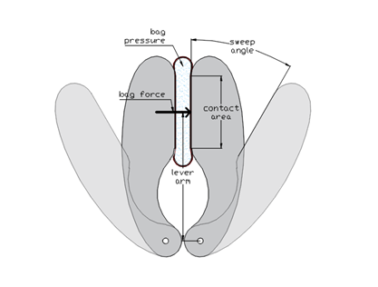

A more direct approach can be used for this design provided the following quantities can be measured:

- Finger-bag contact area
- Finger lever arm length
- Sweep angle

For one particular prototype, we have:

- Finger-bag max contact area: Abag = 90 mm x 115mm
- Finger lever arm length: lfinger = 12 cm
- Sweep angle: $\alpha_{sweep}$ = 30°
- The maximum force of the bag on one finger (when fully squeezed) is, using the same 50% pressure transmission efficiency as before:

$$F_{finger} = 2 A_{bag} P_{airway,max} = 81.199 N$$

The maximum torque needed on each finger is then:

$$ \tau_{finger} = F_{finger} l_{finger} = 9.74 N.m $$ 

Now we can compute the power required for the two-finger gripper using the sweep angular rate ( in 0.3 second):

$$ P_{gripper} = 2 \times \tau_{finger} w_{finger} = 34.01 W $$

The total power for the motor (assuming a single motor) when additionally applying the same 50% motor and gearbox efficiency, we get:

$$ P_{motor} = 2 \times P_{gripper} = 68.03 W \approx 70 W. $$ 

### Benchtop Validation

During testing of a 2-finger gripper design, E-Vent Unit 3.1, equipped with an Andy Mark motor am-3656 (188:1 gearbox) we observed under normal operations a peak current of about 5 A at 12V or 60 W.

### Recommendation Minimums

The minimum motor power is approximately 70 W. Therefore, a power supply at 12 V should be specified with a minimum of a 5.8 (~6 A) supply.

***Caution: The torque required of the motor will be a function of whether the arms are driven directly or with a driving pinion. It is essential to consult your motor curves and apply a safety factor.***

## Motor Selection

Updated 15 April 2020

This page describes our best information to date regarding selecting motors.

### Motor & Encoder

- The mechanical system should be driven with a motor under closed loop control. For feedback measurement, we are using a DC gear motor with integrated quadrature feedback.

- Prototype component: Andy Mark AM 3656 188:1 gearmotor with encoder. This was scavenged from a FIRST Robotics kit and we are using it in test applications. This is provided as an example, builders must use their supply chain to identify correct motors for their application.

- Motor Options: Brushed DC motor with gearbox and position feedback. Any sufficiently high-torque, back-driveable motor with angle sensing, integrated or separated, should work.

**Note: The motor and mechanism, together, must be back drivable in order to move the mechanism by hand, remove the bag and immediately convert to manual bagging. It is not ideal to back drive gear motors, but this is primarily for use in a fault condition.**

### Stepper Motors? – hard

Stepper motors are best suited for precision motion control where the motion profile can be well defined, the load is constant and disturbances are limited. Industrial motion control and 3D printers are good examples.

Patients present a very different scenario where the load on the motor changes dynamically over short and long terms. With each breath the motor faces increasing resistance as the balloon (the patient) is inflated. Over time the patient’s airway resistance and lung compliance can also change. There is no straightforward way to close a PID loop around a stepper; fundamentally it is designed to run open loop. More complicated control strategies can be employed.

***Caution – If a stepper motor is used, position must be taken from an angle sensor so that missed steps do not cause position drift and failures to reach desired tidal volume are not detected and responded to.***

### Operating Parameters

Understanding the best way to care for COVID-19 patients is changing daily.

These are our best, current working specifications. Be sure to apply your own safety factors, recommended 2x.

In advance, we apologise profusely to our international colleagues for using English units and gears. It’s hard to undo this decision at this point.

- Assumed nominal operating parameters: Referencing the most recent clinical documentation of max 40 breath-per-minute (bpm), up to a 1:4 I:E ratio and a pop off set to 40 H2O, our Unit 003 Design consists of:

- rom Power Calculation we estimated 10 N-m of torque required by each finger. Doubling this yields 20 N-m for the gripper. As described in Mechanical our Version 3 has a 1.6 (48/30 teeth) gear ratio yielding a desired motor torque of 12.5 N-m, which we round up to 15 N-m.
- Arm: Approximately 30° back and forth
- Two week operation minimum: approximately 1 million cycles, 100% duty.
- Quadrature encoder integrated (ours provides 7 pulses / rev of motor shaft). This is integrated with the base of the motor so that it does not respond to any backlash in the system.
- The radial force on the gearbox shaft is estimated at 530 N, as described in Mechanical. This is applied by the pinion approximately 1 cm from the face of the gearbox; thus bending on the output shaft must also be considered.
- We have created a Gear Torque and Speed Estimator Spreadsheet, available in Downloads.
***Caution: In deployed use, the motor must be able to operate continuously for several days, 100% duty cycle. This may require larger motors than expected or increased motor cooling to prevent overheating.***

### Windshield wiper motors? – maybe

We have investigated windshield wiper motors and they are NOT back-drivable, due to the worm drive, they lack integrated position sensing, nor can they necessarily take the shaft loads resulting from gear separation forces. People with access to automotive tier suppliers may be able to access better information.

Windshield wiper motors vary greatly in their specifications, so we cannot make general recommendations. If they are to be used, a mechanical arm release should be incorporated so that a bag can be instantly removed to facilitate instant conversion to manual bagging. The larger issue is the lack of position sensing – without this volume control is not feasible nor is safe ventilation even possible. Mechanical cams have been suggested, but they do not enable sufficient control of respiratory parameters to have any useful therapeutic effect. Encoders and potentiometers (POTs) can be used, but they should only be implemented by someone with experience in feedback control. They are a potential solution.

Shown below is a Toyota replacement wiper motor. From inspection we can see that it employs a tapered spline, with limited area for more traditional connections. While there are limit switches (three contactors) there is no accurate position feedback. From inspection of other models, bolt patterns, dimensions and connections vary widely. We hesitate to make any specific recommendations.

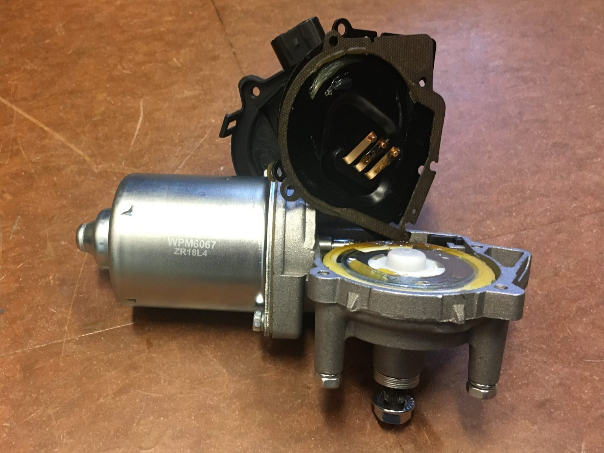

## Plumbing
Updated 1 May 2020

This page describes critical design requirements of the patient breathing circuit. This details a key dead space issue, which if not addressed, will result in a patient breathing in expelled CO2 and deoxygenation fast with immediate adverse result. For a detailed primer on Breathing Circuits read Mapleson’s Breathing Systems.

Normally, self-inflating manual resuscitators are directly connected to the patient’s endotracheal tube adapter.  Manual resuscitators have a “patient valve” that directs oxygen/air gas mixture into the patient and shunts the exhaled gas out to the environment. Integrated into the end bag valve mask (BVM) are a number of critical features:

- Oxygen connection and reservoir
- Pop-off valve for safety (location not important)
- One-way valve that guides air to the patient
- Exhalation valve (this stays closed while there is any pressure on the bag)
- PEEP valve that is installed post the exhalation valve and maintains backpressure
- Sensing port for manometer connection (we use this for our pressure sensor connection)
***Caution: Manual resuscitator bags are in no way FDA approved for use as long-term ventilation solutions.***

Some considerations regarding how the patient should be connected to a manual resuscitator-based ventilator include:

- The ventilator must be placed as close to the patient as possible.
- Bag should be secured to ventilator to prevent an awake patient from pulling on it or otherwise disengaging the bag from the mechanism. This is a fault condition that should be detected by pressure sensing.
- Care must be taken to prevent rebreathing of CO2 due to long hoses. A fundamental challenge is the location of the one way and expiratory valves, which are typically directly integrated into the bag.

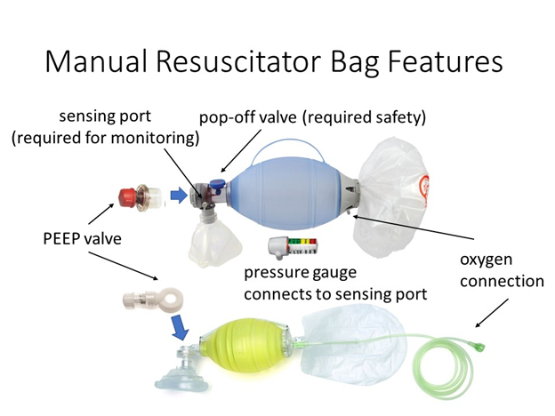

When a manual resuscitator is placed into an MIT E-Vent, or similar design, the system cannot be placed right up against the patient’s head.  In addition, patients need to be turned intermittently for routine care and patients can thrash and move in their beds. Even when patients are paralyzed, the paralytic may wear off at times and we must consider how to keep the patient safe from inadvertent breathing circuit disconnection or extubation.  Therefore, a safe method to extend the “reach” and flexibility of the manual resuscitator to a patient lying on a hospital bed is needed. If a simple tube is used to do so, it creates a critical safety concern of “dead space.” 

***Note: In a 1 m long tube of nominal 2 cm diameter, there is an unacceptable 314 mL dead space that the patient will breath in and out and not be oxygenated.***

Dead space simply means volume in the respiratory circuit that does not participate in gas exchange in the lungs.  Our natural anatomy has dead space as well. Considering gas exchange occurs at the alveoli in our lungs, every anatomical structure above it can be considered “dead space”: nasal/oral passages, pharynx, larynx, trachea, and primary / secondary / tertiary bronchi.  Extending the tubing through which bidirectional flow of inhaled/exhaled gas mixture occurs only increases dead space.

A way to move the patient valve of the manual resuscitator closer to the patient is critical in solving this issue.  Standard ventilator circuits have two limbs, one for inspiration and one for expiration, so that gases can be recaptured by the ventilator. Single limb ventilator circuits with a patient valve located distally already exist on the market, but are not necessarily optimized for use with a manual resuscitator.

***Note: Solving this problem requires creativity – to the best of our knowledge, no manual resuscitator manufacturer makes an approved solution and no manufacturer makes all the parts that will assemble together correctly.***

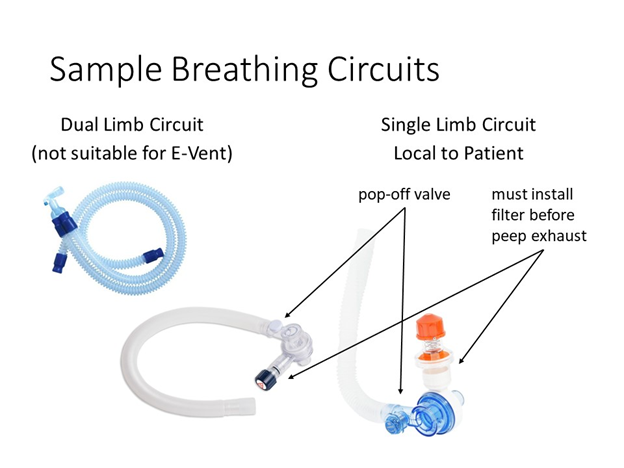
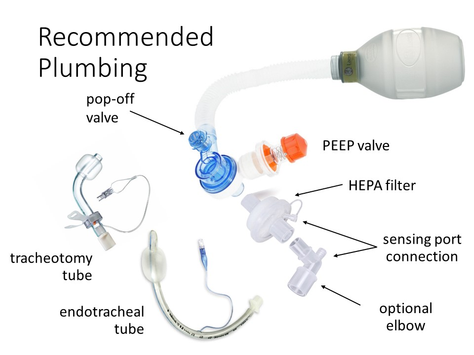
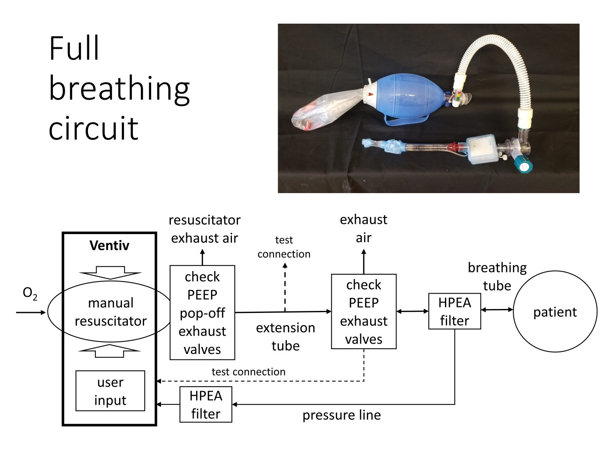

This circuit shows our best assembled circuit with Ambu Oval Silicone resuscitator, manual analog pressure gauge, extension tube, additional patient valving, PEEP valve (green), HELP filter and endotracheal tube. Note, the patient valve on the bag serves partially on exhale, but is not involved in inhale and all air passes through the HEPA filter. 

***Note: Leaving a analog pressure gauge connected to the bag’s unused sensing port (not on the end of the breathing circuit) provides a visual backup to quickly inspect system operation.***

### Industry Notes
In reviewing products available on the market, we have some notes:

No bag makers supply extension hoses with the appropriate fittings.
Bags designed for reuse, i.e. autoclavable, are the only bags that can potentially survive under repeated use. We do not have any information about lifespan.
Some Ambu bags do not have detachable heads, but they do incorporate pop-off and easily attached PEEP valves in their designs. They can only be used if extended with a separate head and extension tube. Ambu Mark 5 and Silicon Oval heads are detachable and may be available as parts. They have easily combined manometers and PEEP valves.
Laerdal bags do have detachable heads, however in the adult sizes these heads do NOT come with pop-off valves; these are available in the Pediatric model. The pediatric model head will probably fit the adult bag.
When a long tube is used, without a dual limb circuit and one way valving to address the dead space issue, this may affect the volume delivered to the patient; it may be necessary to increase the inspired volume.
Addition of the HEPA filter will cause a pressure drop and may affect PEEP settings.
Tightness of all connections is important.
Caution: In the worst-case scenario, placing the head as close as possible to the patient will reduce the dead space, but it is not an optimal or safe solution, especially for patients with reduced inspiratory volume.

### Sample Circuits
Two versions of single limb circuits are shown below. The first uses readily available components and two printed adaptors to make them fit together, with the HEPA filter placed between the exhalation port and the PEEP. The second uses a single limb breathing circuit, with most of the necessary features integrated, and a HEPA filter added inline between the porcine and the breathing circuit. This is a better position as it filters air heading both in and out of the patient, including any air that escapes from the pop-off valve. It may also help to moisten air inbound to the patient.

***Note: The best location, if you have only one filter, for it is between the endotracheal tube and the breathing circuit.***

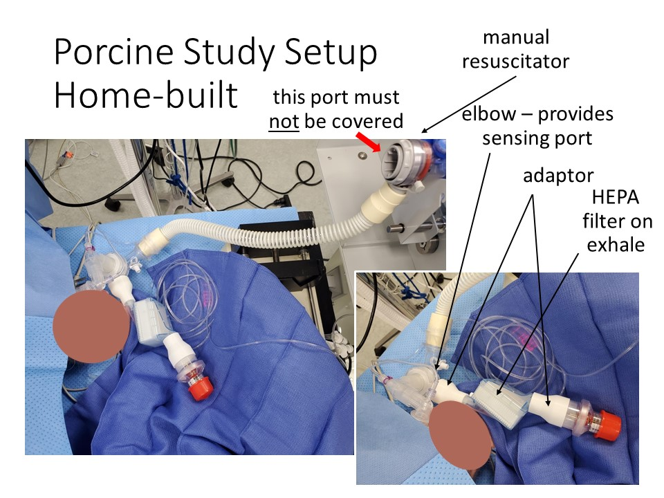

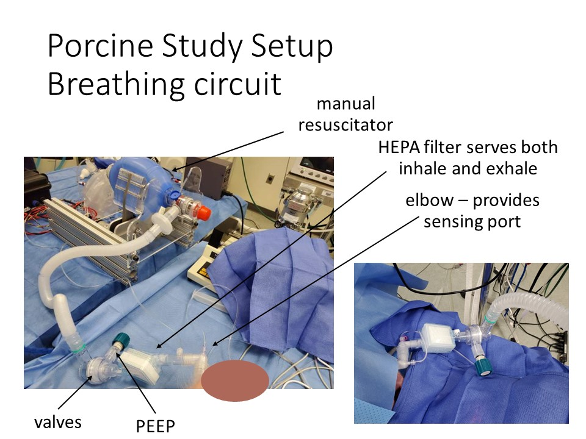

### Dead Air – Additional Potential Solution

Our friends at the US Air project, an Oregon based group of fabricators currently scaling up, have dissembled Ambu bags and developed an adaptor, that demonstrates the feasibility of DIY circuits with a little feasibility.

Ambu has readily available complete patient valve assemblies, though limited information is available on their website. For example:

- Mk IV Ped (w/ pop-off and Mport) #299 000 508
- Silicon Oval (w pop-off and Mport) #470 000 503

The ideal solution is to order these valves, with a hasty solution being “harvesting” valves from disposable SPUR II units. Note: Valve is not replaceable from the bag once removed. This method places the pressure port in the correct position to monitor patient airway pressure.

Connecting these valves can be accomplished with na adaptor. All Ambu valve assemblies have a conical taper from injection molding that allows  for a reliable adapter connector to be quickly fabricated. This adaptor can be 3D printed (fast, but sub-optimal), CNC milled with a sub 1 min cycle (in 6061) or injection molded (ProtoMold quote of $1.63 in 5000 volumes, in HDPE). A hose can now be used to connect this valve to an intact manual resuscitator. The extra valve assembly on the intact manual resuscitator should be inactive for practical purposes.

***Caution: Care must be taken to ensure that connections are secure. Medical grade adhesive should be used.***

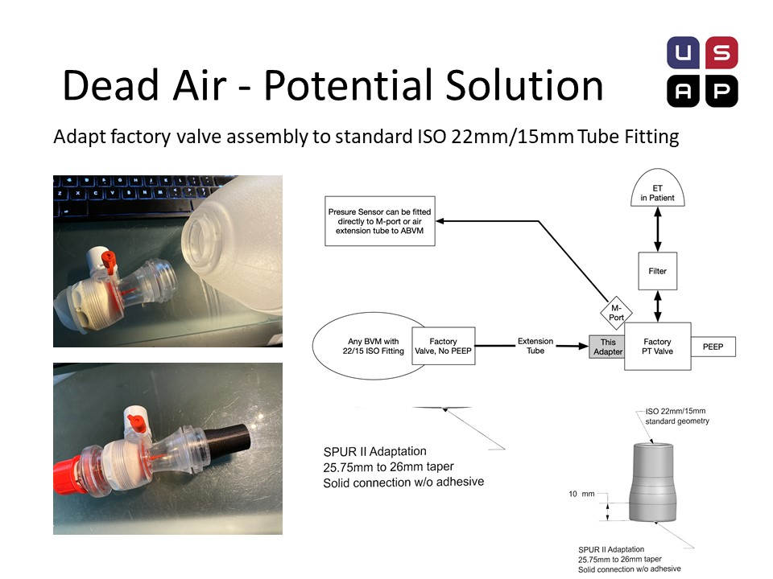

### Bag Sizing

13 April 2020

This page details various bag sizes and why the bag supports in any design should be adjustable. The key is to find points on each bag that provide support and lateral constraint, but do allow the bag to flex as it is compressed. The bag should be centered laterally and vertically between the grippers. The table below gives dimensions at the contact points and the center of the bag. We place the bag with the bottom towards the motor and head, with patient valving, overhanging. Remember, this valving must be extended as described in the Plumbing section.

For practical purposes, spacing the bag mounts 21 cm apart should fit most bags, but the mounts must have vertical adjustability.

Below are pictures of each bag type that we measured, shown in Version 2:
**Note: In Version 3 we added hooks and an elastic to prevent unintended bag removal.**

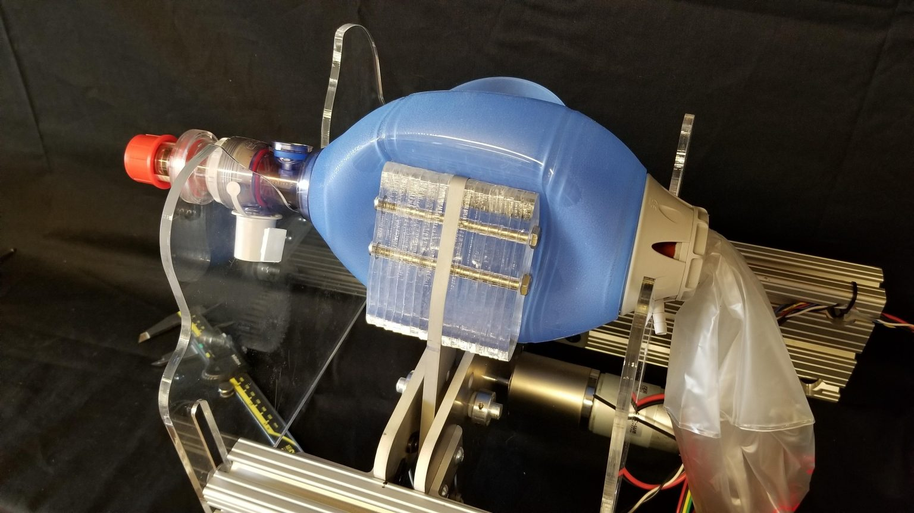

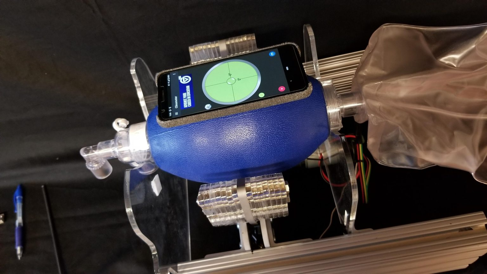

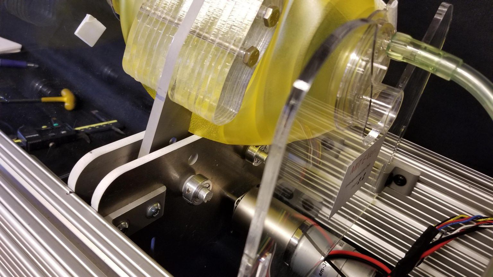

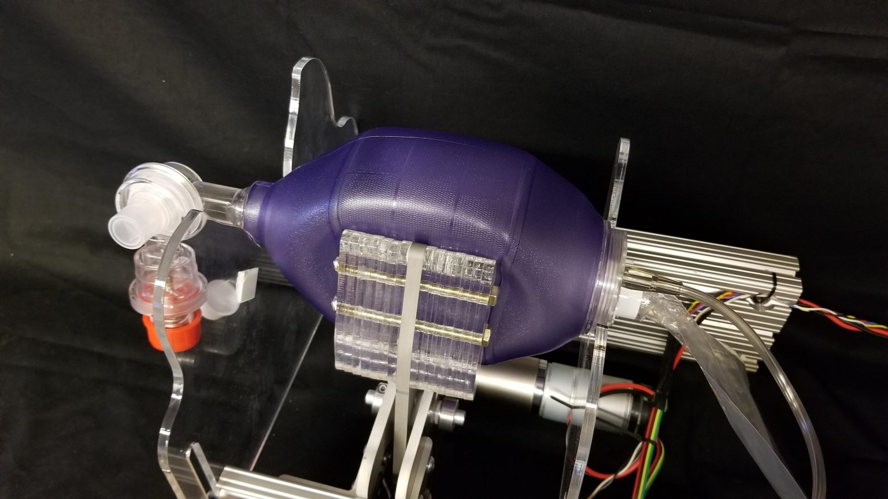