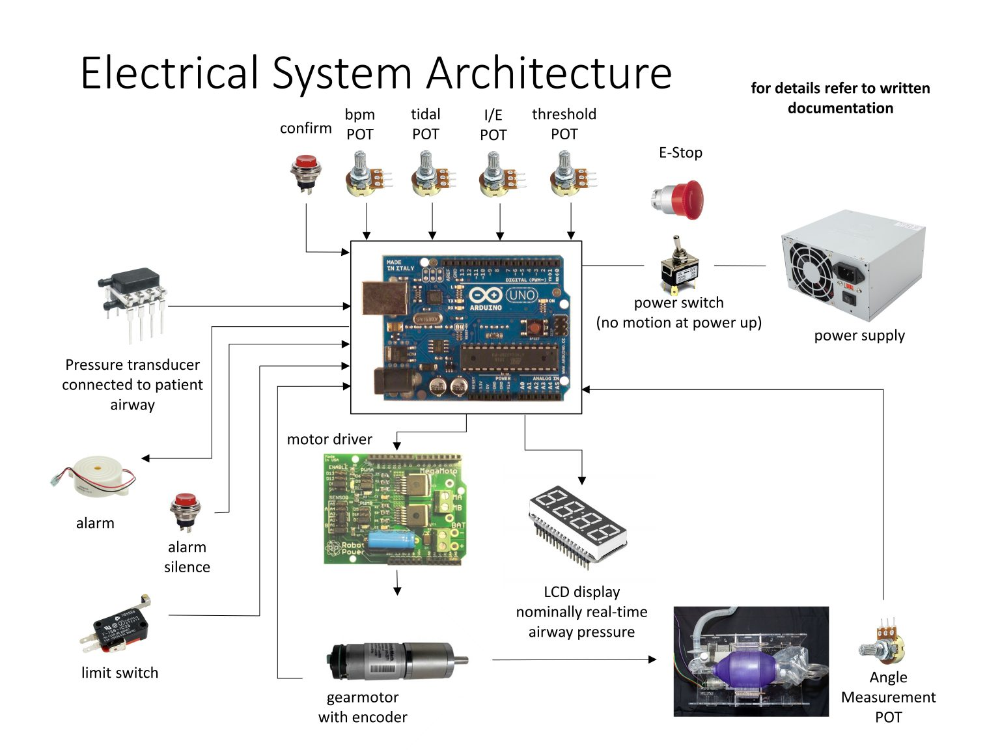
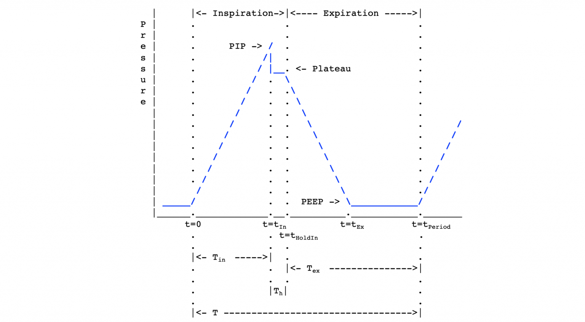
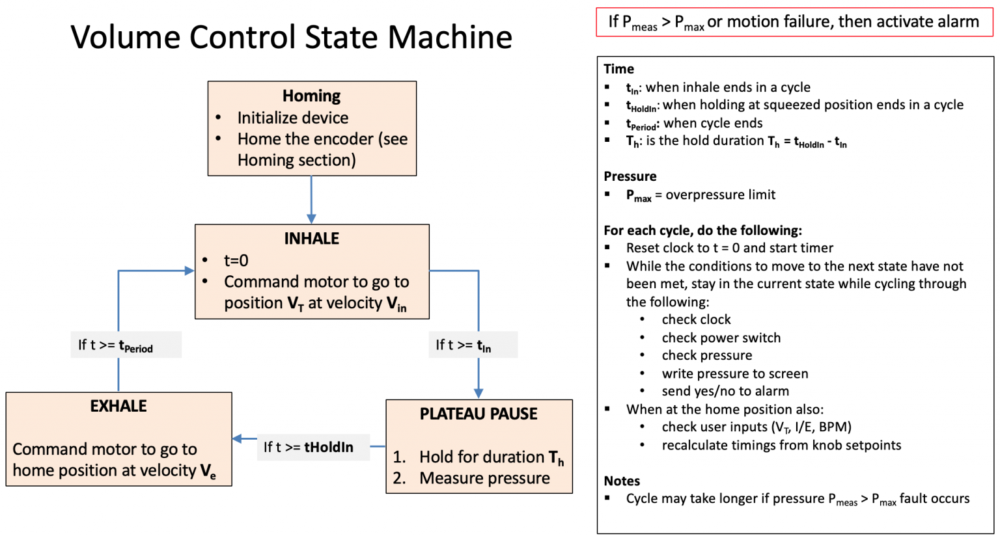
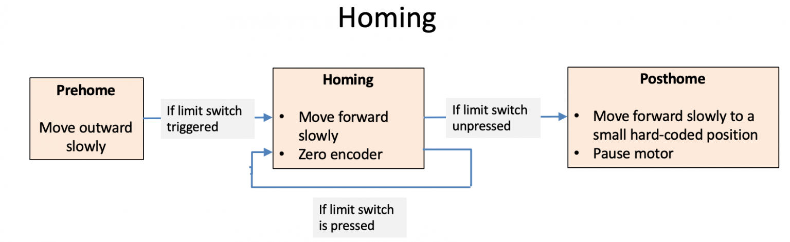
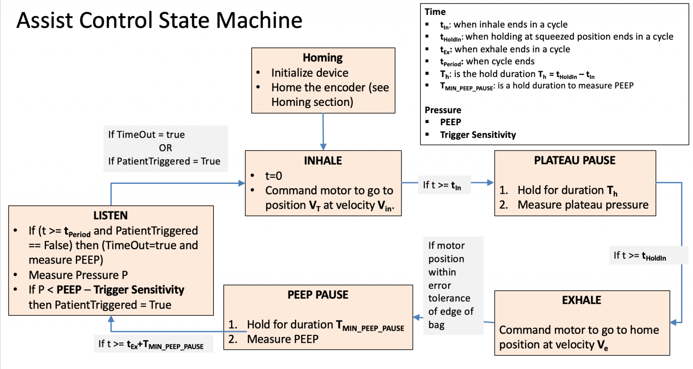
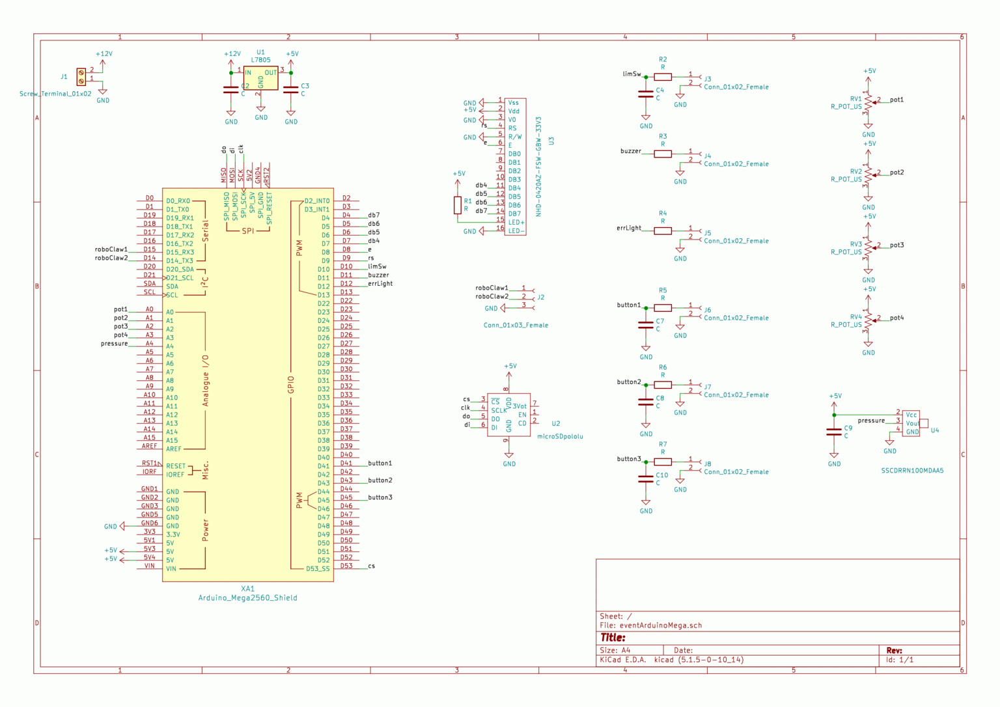

# Controls and Electrical

Updated 25 March 2020

This section provides a description of the system architecture, the control strategy and the underlying logic. All ventilation requires a clinician in the loop to titrate parameters, in response to direct observation of patient physiology. The earliest successful ventilators had limited parameters and we aim to replicate this, with specificity to COVID-19.

Ambu bags are readily available and provide a convenient means to connect to an intubated patient and deliver ventilation. However:

Ambu bags have limited safeties beyond a pop-off valve for pressure release and a PEEP that is set manually. Any ventilator design must incorporate pressure sensing and actively monitor both peak and plateau pressures. Peak pressure exceeding 40 cm H2O (or a pressure set just below the pop-off pressure of the selected bag) must trigger an alarm.

 All decisions are being made on the basis of safety and minimizing complexity, which sometimes means omitting features. Please reference our other documents for more information on these tradeoffs. 

This is a living design and will continue to be updated as we receive more information and learn from our ongoing testing.

## Modes
In the interest of simplicity and ease of use our prototype system has only two modes of operation:

### Mode 1 – Volume Control (VC) 
 Clinician selected breaths are delivered at a constant rate automatically, with pressure monitoring only for safety. VC is only suitable for sedated and paralyzed patients. Tidal Volume, BPM and I:E are set as per clinical guidance.

### Mode 2 – Assist Control (AC) 
When the patient tries to breathe in, the pressure sensor will see a pressure drop, and the machine will begin squeezing the bag in order to assist in the breath. (Because the compression is triggered by the patient’s breath, the machine will be operating in sync with the patient’s natural breathing.) In AC mode the desired BMP is set slower than the patient’s expected breath rate. This sets a timer that is reset each time a patient takes a self-initiated breath. If the timer runs out the system initiates a breath.

*Activation of the assist control must trigger an alarm to indicate that a patient is not self breathing.*

***Caution: Assist control has not yet been tested in a porcine model due to the additional complexity and failure modes.***

- Controllable Parameters
- Breaths per minute (BPM)
- Tidal volume (TV)
- Inspiration to Expiration ratio (I:E)
- Trigger pressure (only active in AC mode)

## Electrical Hardware

Updated 9 April 2020

**Note update on motor specifications and addition of alarm and confirm buttons. This is all key safety information.**

This page provides a description of the minimum hardware set required to control the ventilator as described in the other documentation.

## Motor & Encoder

The mechanical system should be driven with a motor under closed loop control. For feedback measurement, we are using a DC gear motor with integrated quadrature feedback. This is the safest solution.

The beginning point for motor selection should be the in power calculation based on the force needed to compress a bag.

Motor selection will then vary highly as a function of your geometry and we provide information on Motor Selection, based on our design.

***Caution: We have investigated and do NOT recommend stepper motors. They are very hard to control when loading changes.***

### Power Supply
Nominally, a power supply that can deliver 12 V and 5 A is expected to work. Rapid deceleration of the motor causes supply-voltage spikes and must be avoided via correct motor motion profile design. Capacitors should be added across the H-Bridge power leads for extra protection. 

An alternate power supply would be to use a car battery with a 5 A car battery charger connected. This will allow for very high instantaneous power draws and voltage spike absorption. The battery will double as a ~2-3 hour backup in case of building power loss.

### Backup Power
We are recommending using an uninterruptible power supply(UPS) with a runtime up to 30 minutes. This should natively incorporate an alarm in the case of power loss. (Nominally, we source from APC / Schneider Electric.)

### Controller
Currently, an Arduino Mega is used as the microcontroller in this project. This larger, more powerful Arduino is used because it has additional digital, analog, and communication channels. This allows us to incorporate more peripherals simultaneously, such as:
- a screen
- a serial port to the motor controller
- an SD card
- 3 buttons
- 4 potentiometers
- one buzzer
- one light
- one pressure sensor
- one under-voltage sensing pin

This board is used because it has a well-established, free development toolchain, extensive online support, documentation, and community support.

In previous revisions, the microcontroller used was an Arduino Uno – readily available and easy to program, with extensive online support and documentation. It provides 6 A/D pins (for potentiometers and pressure sensors) and 13 digital I/O pins, including dedicated hardware interrupts (for encoders) and PWM pins for H-bridge driving. Eventually, when adding many peripherals, buttons, and communication ports, the Uno ran out of pins, and an Arduino Mega was used instead. Other industry validated controllers can be used, and we may implement them in the future.

### Motor Driver
Use any motor driver with sufficient voltage and current ratings to meet the motor power specifications. Closed loop servo controllers can also be employed. Our control strategy is PWM with a H Bridge. For fastest implementation using cheap, off-the-shelf parts, we recommend an Arduino compatible motor shield. More industrial versions will be safer. Main recommended motor controller specifications:

- Speed plus position command input that is robust
- Accepts quadrature encoder input for closed loop feedback
- Has integaretd safety features, including but not limited to, temperature sensing and current limiting that can be communicated to the controller. (What action a fault condition should initiate is not yet defined, ideally this will throw an alarm and message.)
- Capable of handling up to 15 A. (This is to handle random spikes; you must conduct testing to determine your requirement.)

**Caution: Motor controllers can create significant heat inside an electronics enclosure, be sure to consider cooling. Solutions include active cooling with a fan, connection to a protruding heat sink or connection to a large metal chassis.**

For reference, we are using a RoboClaw Solo motor controller to control a brushed DC gear motor. The RoboClaw firmware uses a velocity PID controller and a position PID controller to command the motor to a desired position at a desired velocity. The PID values must be tuned in advance. Other motor controllers with similar functions will work, we do not recommend any specific controller.

### Inputs
Pressure sensor – Receives a voltage proportional to the pressure in the patient’s lungs. Used to determine max pressure reached during inspiration, and to trigger when the patient is attempting to breathe in during assist mode. Minimum pressure sensor selection:
- Differential (to sense negative pressures)
- Range of up to 100 cm H2O. This is a 2x safety factor.
- Accuracy on the order of 0.5 cm H2O

**Note on Plumbing: The pressure sensor must be connected to the Ambu bag’s sensing port or somewhere in the airflow, as close as possible to the patient, past any valves.**

- Control knob potentiometers (POTs) should all be single turn, 10 K$\Omega$. Single turn is to allow for specific settings to be marked on the face plate.

- POT 1 – Varies inspired volume, sets angular oscillation of the arms. During operation, each arm varies by a maximum of approximately 20°, corresponding to fully squeezing a large bag. This dial varies position from 0% (fully open) to 100% (fully compressed).

- POT 2 – Varies the BPM. This sets the rate from 0 to the maximum BPM given in the clinical document.

- POT 3 – Varies the I:E ratio. Range as given in the clinical document.

**Note: It is not essential that this be settable, one value greater than 1:1 can be selected and the POT repurposed as a threshold for over pressure. (Multiple clinicians have indicated that varying I:E is not critical.)**

- POT 4 – Sets the pressure threshold for detecting assist control. This varies as described in the clinical document.

### Switch – Power on / off

- E-stop – Instantly deactivates the system. This can be the main power switch, but a single pish must fully depower the system. This will allow the bag to be removed and immediate conversion to manual bagging in the case of any major failure.

- Toggle Switch – Mode selection from volume to assist control.

- Momentary Button 1 – Used to temporarily silence alarms. This must be debounced.

- Momentary Button 1 – Used to confirm a change to one of the POTs. This is a necessary safety feature. This must be debounced.

- Limit Switch – Used for homing the arms positions.

### Output
LCD screen displays airway pressure in cm H2O. Other functions can be incorporated later. We are using a 20X4 character LCD display as this will display the minimum information, described in under interface. Any display better than this will be sufficient.

Audible alert buzzer will identify multiple fault conditions.

## High Level Control

Updated 29 April 2020

This page details the control strategies for the MIT E-Vent. Other control strategies with increasing complexity may be implemented at developer discretion and with clinical input.

Notice: Any control strategy must fulfill the requirements described in Key Ventilation Specifications.

The goal of the high-level controller is to provide a controlled volume of air to the patient in a set amount of time. There are two control phases: the inspiratory phase and the expiratory phase (see @fig:waveform). 

There are three input parameters, referencing the Key Ventilation Specifications section:

### Control Knobs
- Tidal Volume (V­T): The total volume of air to be delivered to the patient.

- BPM: Breaths per minute, also called respiratory rate (RR). Typically varies between 8-30 BPM.

- I/E Ratio (1:IE): The ratio of the duration of the inhale to the duration of the exhale. For example, a 1:3 ratio means that the exhale phase lasts three times longer than the inhale phase. Typically varies between 1:1 to 1:3, with a maximum of 1:4 currently being observed in COVID-19 patients.

- Trigger Sensitivity: This setting is relevant to the assist control mode, and specifies the pressure threshold below PEEP for triggering a patient-triggered inhale cycle. See Clinical page.

- In addition to these inputs set by the clinician, the high-level controller uses two more inputs: the motor encoder position and the system pressure. Its job is then to translate all these inputs into the motor commands the low-level controller needs: desired motor speed and position.

Note that because our device does not directly measure volume, the tidal volume (V­T) input of our controller is specified as a percent of a full compression of the Ambu bag instead of Liters. The percent (%) of bag compression from 0 – 100% maps to the encoder pulses that correspond to how far the fingers of the device move towards or away from each other and this determines the volume of air delivered.

### Calculating Waveform Timing & Durations

The pressure signal looks in particular as follows:

{#fig:waveform}

As a function of the three tunable inputs VT, BPM and IE, our controller determines the following timing durations noted in the waveform above:

Period (T): The duration (in seconds) of an inhale/exhale cycle.
$$T = 60 / BPM$$

T­$_h$: The duration (in seconds) of an inspiratory hold or pause at the end of inhale during the inspiratory phase for plateau pressure. This is usually a pre-determined constant that is not tunable.

T$_{in}$: The duration (in seconds) of the inhale time of the inspiratory phase.

$$T_{in} = \frac{T}{1 + IE} – T_{in}$$

(Note: Here IE represents the ratio between Inspiration and Expiration, e.g. if I/E is 1:3 then IE is 3)

T$_{ex}$: The duration (in seconds) of the expiratory phase.

$$T_{ex} = T – (T_{in} + T_{in})$$

In addition to the timing parameters, the controller determines the following rotation rates:

V$_{in}$: The rotation rate of the inspiratory phase (in pulses/second).

$$Vin = V_T / T_{in}$$

V$_e$: The rotation rate of the fingers in the expiratory phase (in pulses/second). Note that during exhalation, our device does not control flow rate out of the patient. This velocity is simply the velocity of the fingers opening and is not related to expiratory flow rate.

In addition to timing and rotation rates, there are four measurable pressure parameters that must be taken into account (see @fig:machine-control):

P$_{max}$: The maximum allowable pressure (set to 40 cmH20). A pop-off set for that threshold is usually provided for safety – see plumbing. 

PIP: The Peak Inspiratory Pressure (PIP) is the maximum pressure during inhale. We consider 40 cmH20 to be the upper pressure limit for safety. This also corresponds to the over-pressure release valve limit on some Ambu bags.

P$_{plat}$: The plateau pressure of the inhale. An important diagnostic number for clinicians.

PEEP: The PEEP (positive end-expiratory pressure) is a residual pressure in the system after exhale. We do not directly control this value, but it is typically controlled manually via a PEEP valve on the Ambu Bag.

### State Machine Summary
With time t being the amount of time spent in the current cycle. The waveform timings and pressure readings are then used to control a state machine that switches between phases in the control loop (see @fig:machine-control).

{#fig:machine-control}

During the setup phase, we initialize the program, start serial communication with the motor controller, and home the encoder.

{#fig:homing}

In the inspiratory phase, we command the motor to go to position VT at velocity Vin. After Tin seconds, we switch to the pause state.

In the pause state, we hold for time Th and measure the plateau pressure. We then switch to the expiratory phase.

In the expiratory phase, we command the motor to go to position 0 at velocity Ve. After time Tex, we switch back to the inspiratory phase.

### Plateau Pressure
Each time the arms close, we implement a 0.10 s pause before they open. This does not affect the I/E ratio, but it is necessary to hold the air into the patient. During this phase the airway pressure is measured and displayed. This indicates “plateau pressure” and will guide clinical decision making. This pressure will be displayed until the next cycle and update.

### Alarms Functions

All alarms must simply, concisely, and clearly alert the clinician of the type of fault, so that the clinician can decide how to proceed. For example, a mechanical fault requires a different clinical response than a patient who stops breathing on assist mode.

Alarms specifically related to pressure sensing are also describe in Pressure Measuring.

### Assist Control

Assist Control differs from regular volume control in that the Exhale state is split into 3 states. In the first Exhale state, the fingers move to their home position at the edge of the bag. In the second state, Exhale Pause, the fingers pause for a short time and measure the PEEP. In the third state, Listen, we wait either for the patient’s own inhalation to trigger the Inhale state, or we wait for a set amount of time (like in normal Volume Control) and then trigger the Inhale state automatically. 

In the Assist Control mode, a notification (not necessarily a full alarm) should also sound whenever a breath is NOT activated by the patient and the system’s timer kicks in to command a breath. Other faults must be detected, such as mechanical failures to reach desired positions, etc.

## Circuit Diagram

Updated April 12, 2020

Arduino Mega Ventilator Circuit
As the ventilator gained features and became more complex, an Arduino Uno was no longer adequate. The ventilator needed more analog, digital, and communication ports. Because of this, the system was upgraded to an Arduino Mega. The Arduino Mega is connected to a prototype circuit board that interfaces with the screen, buttons, and potentiometers.

The new circuit diagram for the logic side of the circuit is as follows:

This page provides a reference design for an Arduino based circuit showing the simplest device embodiment, including pressure sensing. Other industry validated controllers are applicable.

**Notice: Any circuit must fulfill the requirements described in Key Ventilation Specifications.**

## Pressure Measuring

Updated 4 April 2020

This page summarises the importance of pressure measuring and monitoring even in the simplest ventilation scenarios. A pressure gauge attached to the manual facilitator’s sensing port, while better than nothing, provides only partial information and cannot be used for triggering alarms or detecting inspiration in a non-paralysed patient and providing Assist Control, which is explained on the Clinical page.

The pressure sensor, described in Electrical Hardware and Controls, is to be connected in a position so as to allow sensing of pressure in the patient’s airway, as shown in Plumbing. Because pressure transducers with the correct specifications to sense human respiration are in low supply, these sensors should not be single-use. To protect the pressure sensor, a small inline HEPA filter should be placed on the sensing line between the patient and the sensor to prevent viral migration and patient to patient infection.

### Key Readings
The first three readings should be displayed to the clinician and the fourth is a condition that must be detected.

- PEEP – (positive end-expiratory pressure) – This is manually set by the PEEP valve 
- Plateau Pressure – This varies as a function of airway resistance
- PIP (Peak Inspiratory Pressure) – This varies as a function of airway resistance
- Inhalation Detection – This dip in pressure, with relation to the resting PEEP pressure, indicates that a non-paralysed patient is attempting to breathe and should initiate a cycle.

### Sanity Checks & Alarms

There should be checking each cycles for relations and consistencies among PEEP, Plateau, and PIP and when discrepancies an alarm condition should be triggered accordingly:

- In Volume Control ventilation, it is expected that PIP > Plateau.
- It is expected that Plateau > PEEP in order to have a positive driving pressure. (Driving pressure = Plateau – PEEP)
- PEEP should not fall below a predetermined value, to prevent alveolar collapse, and the displayed value should match the value set manually with the PEEP valve.
- Plateau should not exceed a predetermined value, nominally 30 cm H2O in ARDS.
- PIP should not exceed a predetermined value; 40cmH2O in general. This value should be set (hard coded) to below the cracking pressure of the pop-off valve.
- A leak or disconnect in the system will be detected as plateau pressure below a predetermined level, e.g. 5 cm H2O.

### Assist Control

Assist Control is dependent on a well executed pressure detection system, namely the ability to also read negative deflection of pressure when pressure falls below PEEP or baseline during a “detection window period” towards the end of expiration phase. 

### List of Alarms

Updated 1 May 2020

#### Clinical Guidance

We have interviewed clinicians and reviewed existing ventilator standards to determine the most important alarms needed, the appropriate action to take when an alert condition is detected, and the expected behavior for silencing alarms.

#### Silencing

- The alarm silence button should silence only the alarm tone, the visual notification should remain
- All alarms should be silenced for two minutes, even if a new alarm is triggered, the alarm silence should be maintained
- Pressing the alarm silence button again, before two minutes have elapsed should unsilence the alarms
- If multiple alarms are active, they should be visually displayed with LED’s. On the screen, the messages should cycle through.
- The following table describes in detail the most important alarms identified. You are welcome to add more alarms as needed.

See a table with a list of alarms here: https://e-vent.mit.edu/controls/list-of-alarms/