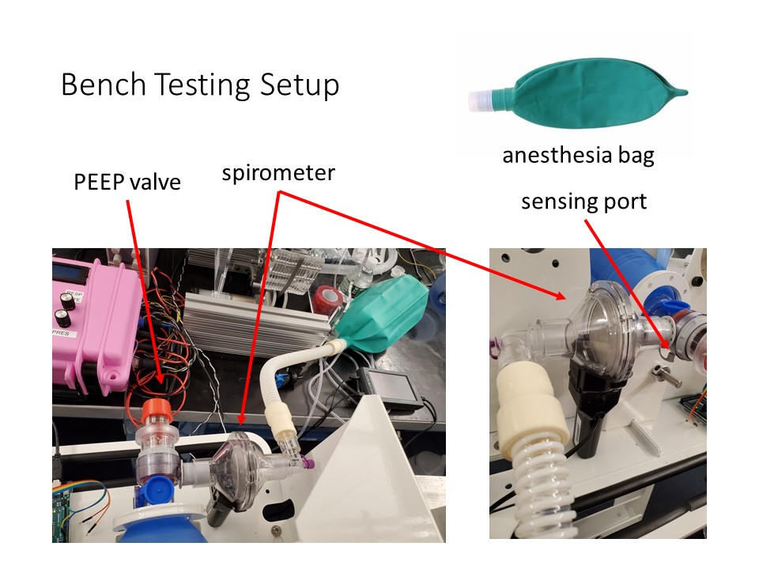

# Testing

Updated 30 March 2020

While later we will seek to publish more complete results, these are a summary of our findings.

We are working with certified animal testing labs to conduct studies in animal models under IACUC (Institutional Animal Care and Use Committee) approved protocols. A porcine model was chosen as pigs have a respiratory systems that is most similar to human beings. This is essential in order to evaluate system performance and safety. We would like to anonymously acknowledge the laboratory staff for their tireless efforts, and the donors who are enabling this rapid scale-up of animal testing.

1. [Study #1 – 20 March 2020](https://e-vent.mit.edu/testing-results/study-1-march-20th-2020/)
2. [Study #2 – 24 March 2020](https://e-vent.mit.edu/testing-results/study-2-24-march-2020/)
3. [Study #3 – 26 March 2020](https://e-vent.mit.edu/testing-results/study-3-26-march-2020/)
4. [Study #4 – 1 April 2020](https://e-vent.mit.edu/testing-results/study-4/)

## Benchtop Testing Procedure
We are also conducting a benchtop calibration procedure to validate system operation under pressure load and calibrate the arm position to volume delivered. This testing setup is shown below.

Materials:

- Anesthesia bag
- Manual resuscitator with exhaust port compatible with PEEP valve, pop-off safety valve, and manometer / sensing port
- Spirometer that measures flow and volume
- Gas pressure sensor connected to the manual resuscitator’s manometer / sensing port
- Adjustable PEEP valve
- An anesthesia bag should be connected to the end of the manual resuscitator’s 22mm connection and a PEEP valve should be used to best simulate a patient lung. (We do not yet know if connection sizes are standardized.) If compliance of the anesthesia bag is too high, one can use elastic bands around the anesthesia bag to decrease compliance.

- After loading the manual resuscitator into your ventilator, connect the spirometer and anesthesia bag in series with the manual resuscitator.  Place PEEP valve onto the exhaust port and set it to 5 cm H20 initially.  Start the ventilator, run it at a low breath rate and start at a low percentage compression setting. Measure the volume delivered using the spirometer. Increase the compression incrementally and plot the delivered volume, thus characterizing a specific bag. I/E, BPM and PEEP can be varied to further characterize the system. Constrain the bag, set the PEEP to maximum and run the system at a high breath rate until the pop-off valve activates and observe maximum current – this is effectively a full load test.

