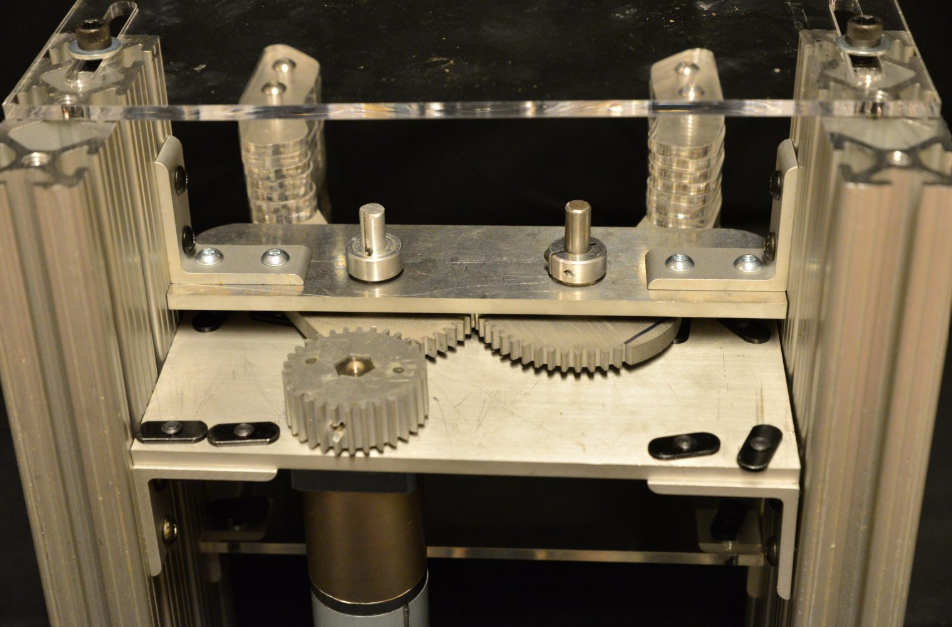
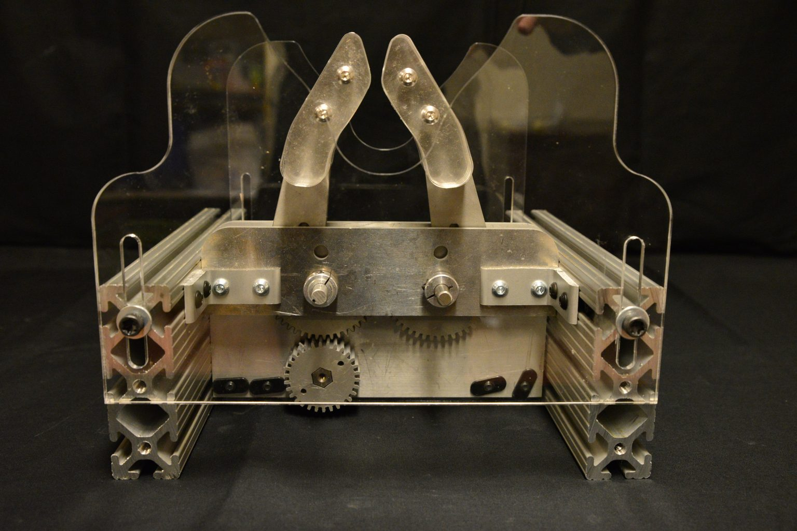
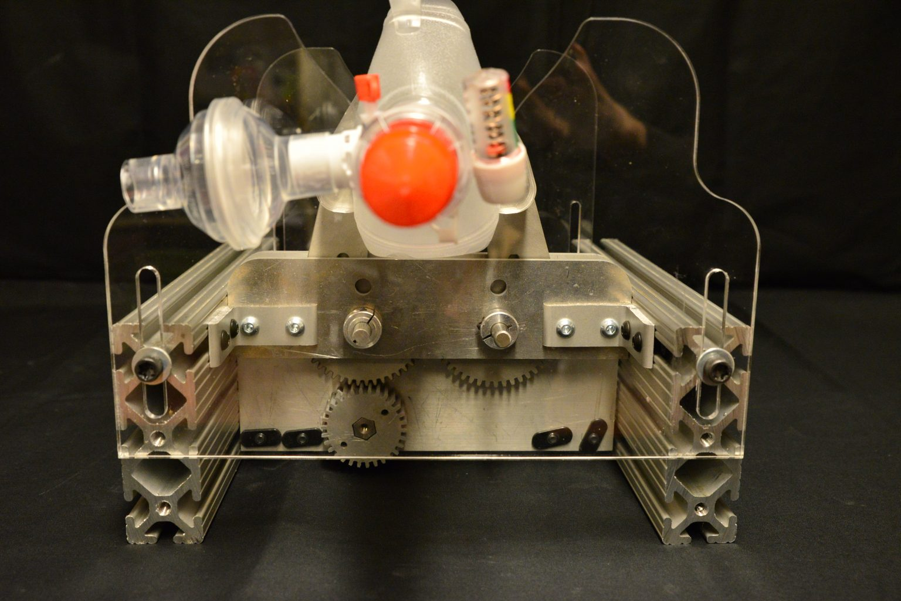
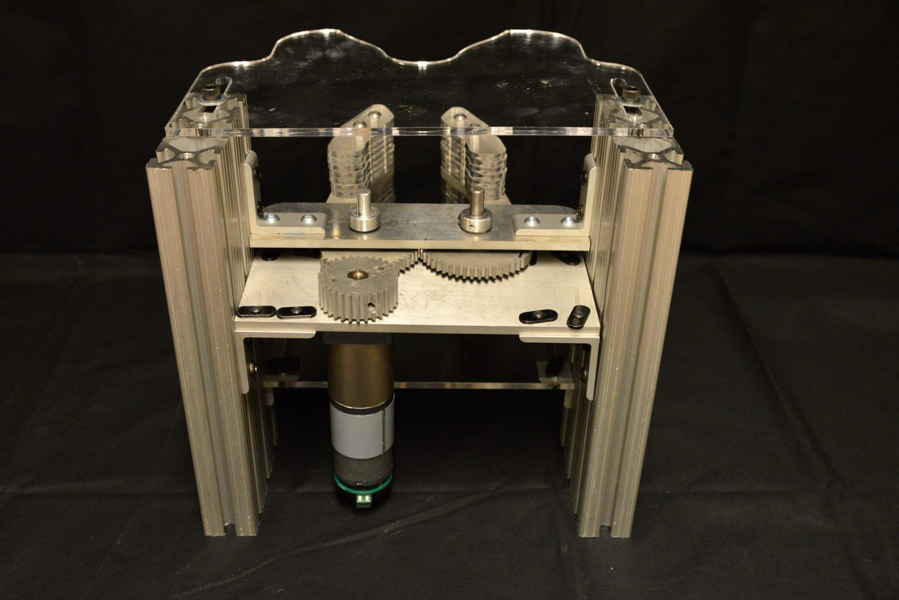
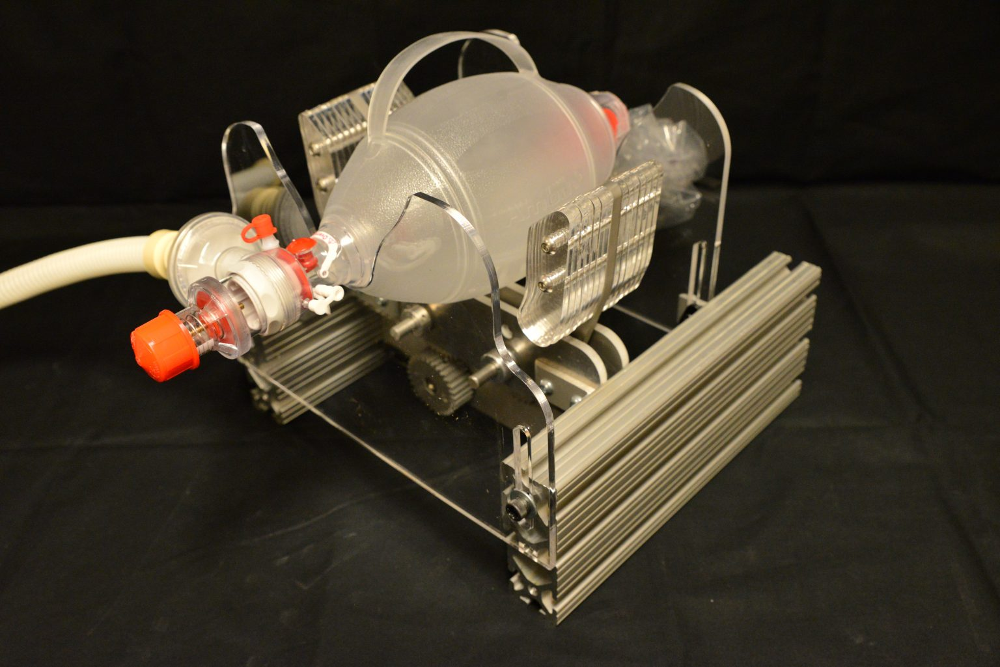
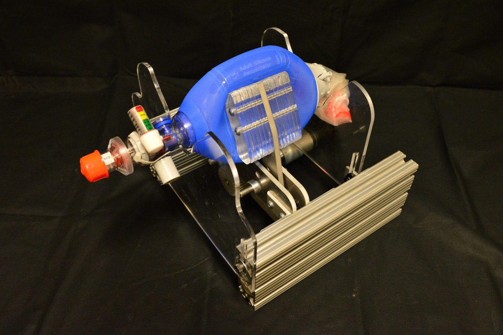
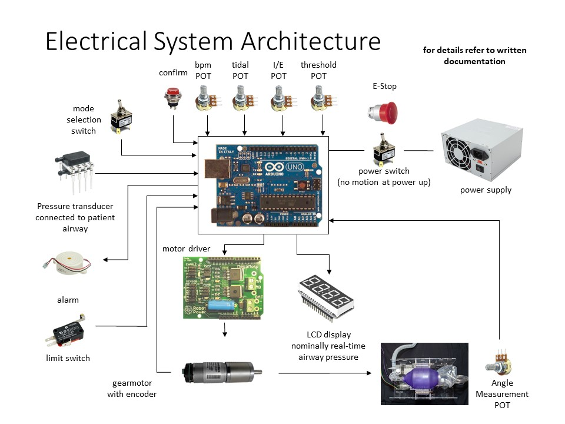
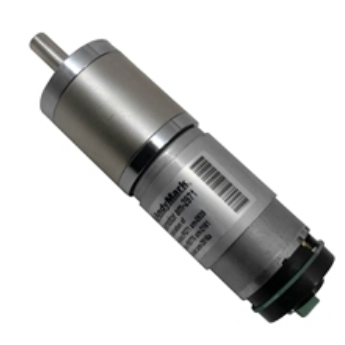
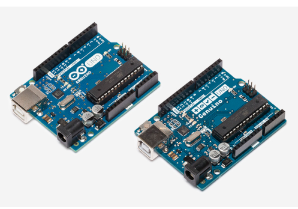
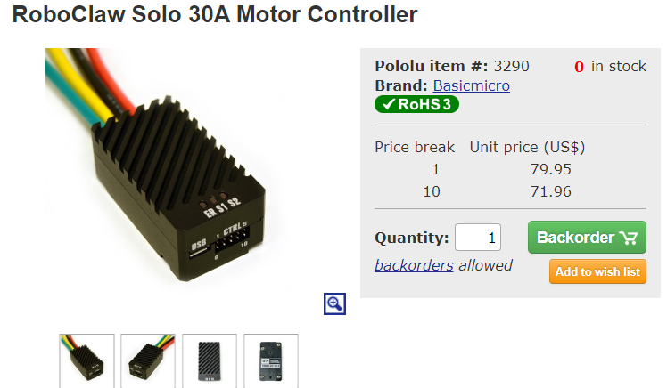

# Diseño Mecanico

 Como es el E-vent en accion? 

 Para que veas como funciona E-vent [dirigete aqui](https://e-vent.mit.edu/wp-content/uploads/2020/03/002-bench-testing-scaled-1.mp4)

 

## Ficheros para descargar

Sigue este [link](C:\Users\linigodelacruz\Documents\CoViD-19\mit-emergency-ventilator\src\MITeVentDXFs\DXFs-For-Website) donde estan todos los .dxg ficheros.

**Esta sección documenta el diseño mecánico del MIT E-Vent.**

**Por favor, comprenda que estamos diseñando, probando y publicando información lo más rápido posible. ¡No tenemos información oculta y se publicarán planes más detallados tan pronto como los dibujemos!***

**Nota:** Cualquier diseño mecánico debe cumplir con las especificaciones descritas en la [Sección de inicio](./ 02-Getting-started.md).

**Este es un prototipo.** Estamos en proceso de probar y refinar este diseño conceptual para aumentar la robustez. El concepto básico consiste en dos brazos que se cierran suavemente sincronizados para comprimir la bolsa. Esto debe combinarse con un sistema de control de circuito cerrado. Los principales requisitos de diseño mecánico incluyen:

- ¡Sé amable con tu bolso y sus mangueras! Hasta 2x7x24X60x30 = 604,800 ciclos.
- ¡Operación a prueba de fallas! Si la máquina falla, un médico debe poder realizar la conversión a embolsado manual.
- ¡Mantenlo simple y hazlo súper! Permitir que otros fabriquen.
- ¡Muchas posibilidades de motor de accionamiento! Habilite múltiples motores y configuraciones.

Las [Unidades versión 002](../../ img / mit-e-vent-unit-002-setup.jpg) que se muestran aquí se desarrollaron para maximizar la flexibilidad durante las pruebas, de modo que la posición de la bolsa y el motor pudieran ajustarse. Nada de esta capacidad de ajuste es necesaria una vez que se selecciona una bolsa en particular.

Ahora se establecen las dimensiones básicas y cualquier diseñador mecánico experto podrá ejecutar este diseño y ajustarlo para adaptarse a los materiales disponibles localmente y las tecnologías de fabricación.

Tenemos acceso inmediato a cortadores de chorro de agua y láser y componentes 80/20, sin embargo, estas piezas se pueden fresar, atornillar y soldar con CNC según sus especificaciones.

## Documentación de imágenes útiles

***Precaución: las fuerzas y los pares son mucho más altos de lo esperado cuando una bolsa Ambu está conectada a un sistema respiratorio humano, las presiones pueden variar hasta 40 cm H2O y, potencialmente, incluso más, dependiendo de la frecuencia respiratoria. Debe haber una válvula de liberación de presión establecida a 40 cm H2O; sin esto, las presiones más altas correrán el riesgo de lesiones permanentes o la muerte. Los pulmones enfermos pueden tener un cumplimiento del orden de 10 veces menor que el de los pacientes sanos y esto agrava aún más el problema.***

### Diseño temprano (Unidad 001)

Una unidad prototipo temprana se muestra a continuación en acrílico cortado con láser. La Unidad 001 fue similar y se sometió a pruebas. La unidad 002, fabricada con un marco de metal 80/20, para abordar la durabilidad y maximizar la flexibilidad durante las pruebas, se somete a pruebas hoy.

La colección de imágenes de los primeros diseños se encuentra [en esta carpeta](C:\Users\linigodelacruz\Documents\CoViD-19\mit-emergency-ventilator\img\early-design-001)

# Diseño electrico

Esta sección muestra una descripción del conjunto mínimo de hardware requerido para controlar el ventilador como se describe en la otra documentación.

## Motor y codificador

El sistema mecánico debe manejarse con un motor bajo control de circuito cerrado. Para la medición de retroalimentación, estamos utilizando un codificador de cuadratura en el motor y un potenciómetro (POT) en los brazos móviles para medir el ángulo absoluto.

### Opciones de motor:

Motor DC cepillado con caja de cambios y retroalimentación de posición. Debería funcionar cualquier motor de par motor suficientemente alto con detección de ángulo, integrado o separado. La potencia se estima en 36 W o más, con un factor de seguridad recomendado.

**Precaución: si se utiliza un motor paso a paso, la posición aún debe tomarse del sensor de ángulo para que los pasos omitidos no provoquen un desplazamiento de la posición**

**Precaución: el motor y el mecanismo, juntos, deben ser manejables hacia atrás para mover el mecanismo con la mano, quitar la bolsa e inmediatamente convertirla en una bolsa manual.**

- Parámetros de funcionamiento nominales supuestos: Referencia a la documentación clínica: máximo 25 respiraciones por minuto (lpm) y hasta 1: 3 Inspiración: Relación de caducidad (relación I: E) (por ejemplo: bolsa apretada por 1 unidades de tiempo, bolsa relajada por 3 unidades de tiempo). Tenga en cuenta que los pacientes con COVID-19 pueden necesitar mayores proporciones I: E.

- Componente del prototipo: [Andy Mark AM 2971 gearmotor](https://sites.google.com/site/frc5064/parts/motors-and-gearboxes/-pg71-planetary-gearbox-with-rs775-motor-and-encoder). 

    

  Esto fue eliminado de un kit FIRST Robotics, es adecuado para pruebas, **pero no ha sido probado para un uso seguro a largo plazo. Los constructores deberán buscar otro motor.**

Si bien la máquina debe ser capaz de operar continuamente a un volumen corriente máximo y a un máximo de bpm, en la práctica, los profesionales médicos a menudo no operan con un gran volumen de marea y altos bpm simultáneamente. En funcionamiento normal, las relaciones I: E alrededor de 1: 2 y 12 lpm son un punto de diseño central decente. El volumen corriente en función de la posición necesita ser calibrado.

**Precaución: en uso desplegado, el motor debe poder funcionar continuamente durante varios días, 100% de ciclo de trabajo. Esto puede requerir motores más grandes de lo esperado o mayor enfriamiento del motor para evitar el sobrecalentamiento.**

## Fuente de alimentación

Nominalmente, se espera que funcione una fuente de alimentación que pueda suministrar 12 V y 5 A. La desaceleración rápida del motor provoca picos de tensión de alimentación y debe evitarse mediante el diseño correcto del perfil de movimiento del motor. Se deben agregar condensadores a través de los cables de alimentación del puente H para una protección adicional.

Una fuente de alimentación alternativa sería utilizar una batería de automóvil con un cargador de batería de automóvil de 5 A conectado. Esto permitirá consumos de energía instantánea muy altos y absorción de picos de voltaje. La batería se duplicará como respaldo de ~ 2-3 horas en caso de pérdida de energía del edificio.

## Controlador

Microcontrolador para temporización, medición y actuación: [Arduino Uno] (https://www.arduino.cc/en/Guide/ArduinoUno): fácilmente disponible y fácil de programar, con un amplio soporte y documentación en línea. Proporciona 6 pines A / D (para potenciómetros y sensores de presión) y 13 pines digitales de E / S, incluidas interrupciones de hardware dedicadas (para codificadores) y pines PWM para la conducción de puentes H. Se pueden usar otros controladores validados por la industria, y podemos implementarlos en el futuro.
    

## Motor Driver

Use cualquier controlador de motor con voltaje y corriente suficientes para cumplir con las especificaciones de potencia del motor. Los servocontroladores de circuito cerrado también se pueden emplear. Nuestra estrategia de control es PWM con un puente H. Para una implementación más rápida utilizando piezas baratas y listas para usar, recomendamos un protector de motor compatible con Arduino.

Como referencia, estamos utilizando un [controlador de motor RoboClaw Solo] (https://www.pololu.com/product/3290) para controlar un motor de engranaje de CC cepillado. El firmware RoboClaw utiliza un controlador PID de velocidad y un controlador PID de posición para ordenar al motor a una posición deseada a la velocidad deseada. Los valores PID deben ajustarse de antemano. Otros controladores de motor con funciones similares funcionarán, no recomendamos ningún controlador específico.

  

## Entradas

Los potenciómetros de la perilla de control (POT) deben ser todos de un solo giro, 10 K $\Omega$. Un solo giro es permitir que ajustes específicos se marquen en la placa frontal.

Sensor de presión: recibe un voltaje proporcional a la presión en los pulmones del paciente. Se utiliza para determinar la presión máxima alcanzada durante la inspiración y para disparar cuando el paciente intenta respirar durante el modo de asistencia. El sensor de presión seleccionado debe ser diferencial (para detectar presiones negativas) con un rango de hasta 100 cm H $_2$ O. Este es un factor de seguridad 2x. Nuestros sensores provienen de Honeywell.

**Nota sobre fontanería: el sensor de presión debe estar conectado al puerto de detección de la bolsa Ambu o en algún lugar del flujo de aire, lo más cerca posible del paciente, más allá de cualquier válvula.**

**POT 1** - Varía el volumen inspirado, establece la oscilación angular de los brazos. Durante la operación, cada brazo varía en un máximo de aproximadamente 20 grados, lo que corresponde a apretar completamente una bolsa grande. Este dial varía la posición del 0% (completamente abierto) al 100% (completamente comprimido).

**POT 2** - Varía el BPM. Esto establece la tasa de 0 a la BPM máxima dada en el documento clínico.

**POT 3** - Varía la relación I: E. Rango según lo indicado en el documento clínico.

Nota: No es esencial que esto sea configurable, se puede seleccionar un valor mayor que 1: 1 y el POT se puede reutilizar como un umbral para la sobrepresión. (Varios médicos han indicado que variar I: E no es crítico).

**POT 4** - Establece el umbral de presión para detectar el control de asistencia. Esto varía según lo descrito en el documento clínico.

Interruptor de botón pulsador: confirma la selección del usuario de la nueva configuración POT. Esta es una seguridad importante.

Interruptor - Encendido / apagado

E-stop: desactiva el sistema al instante.

Interruptor: selección de modo del volumen para ayudar al control.

Interruptor de límite: se utiliza para dirigir las posiciones de los brazos.

## Salida

La pantalla LCD muestra la presión de la vía aérea en cm H2O. Otras funciones se pueden incorporar más adelante. Estamos utilizando una pantalla LCD de 20 × 4 caracteres, ya que esto mostrará la información mínima, descrita en la interfaz. Cualquier pantalla mejor que esto será suficiente.

El zumbador de alerta audible identificará múltiples condiciones de falla.