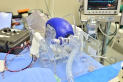
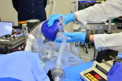
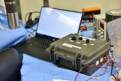
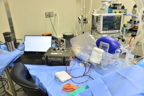

# Testing results

They  are working with certified animal testing labs to conduct studies in animal models under [IACUC-Institutional Animal Care and Use Committee](https://olaw.nih.gov/resources/tutorial/iacuc.htm) approved protocols. A porcine model was chosen as pigs have a respiratory systems that is most similar to human beings. **This is essential in order to evaluate system performance and safety. We would like to anonymously acknowledge the laboratory staff for their tireless efforts, and the donors who are enabling this rapid scale-up of animal testing.**

## Study 1 – 20 March 2020
Porcine study Nr 1 was conducted at a leading research facility in the Boston area. In addition to the facility staff (veterinarians, technologists, and Study), our on-site team consisted of Emergency Medicine and Anesthesia physicians working along side mechanical design, manufacturing, controls, and electrical engineers. The goals of this study were as follows:

- Conduct a functional test of the prototype MIT E-Vent Unit 001.
- Compare ventilation with the E-Vnet to that of a Puritan Bennet 840 Ventilator system (2016 model year, [Medtronic](https://www.medtronic.com/covidien/en-us/products/mechanical-ventilation/puritan-bennett-840-ventilator.html)) graciously loaned to us.

### Key Learnings (more results will be forthcoming)

- We identifies deficiencies in the all-laser cut design. We have already transitioned to a metal frame design.
- We more accurately defined key parameters related to power requirements for a drive system.
- We investigated potential control strategies and identified key UI/UX requirements as well as human factors.
- We determined key pressures when connected to a real lung and with PEEP set.

### Next Steps

The next study will conduct a functional test Unit 002 in a similar porcine model.