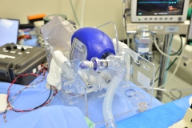
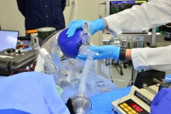
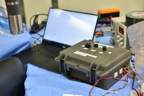
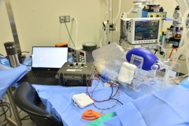

# Resultados de la prueba

Están trabajando con laboratorios de pruebas de animales certificados para llevar a cabo estudios en modelos animales bajo los protocolos aprobados por [IACUC-Comité Institucional de Cuidado y Uso de Animales] (https://olaw.nih.gov/resources/tutorial/iacuc.htm). Se eligió un modelo porcino ya que los cerdos tienen un sistema respiratorio que es más similar al de los seres humanos. **Esto es esencial para evaluar el rendimiento y la seguridad del sistema. Nos gustaría reconocer de forma anónima al personal del laboratorio por sus incansables esfuerzos, y a los donantes que están permitiendo esta rápida ampliación de la experimentación con animales.**

## Estudio 1 - 20 de marzo de 2020
El estudio porcino número 1 se realizó en una instalación de investigación líder en el área de Boston. Además del personal de la instalación (veterinarios, tecnólogos y estudio), nuestro equipo en el lugar consistía en médicos de medicina de emergencia y anestesia que trabajaban junto con ingenieros mecánicos, de fabricación, controles e ingeniería eléctrica. Los objetivos de este estudio fueron los siguientes:

- Realice una prueba funcional del prototipo MIT E-Vent Unit 001.
- Compare la ventilación con el E-Vnet con la de un sistema de ventilación Puritan Bennet 840 (año modelo 2016, [Medtronic](https://www.medtronic.com/covidien/en-us/products/mechanical-ventilation/puritan- bennett-840-ventilator.html)) gentilmente prestado a nosotros.

### Aprendizajes clave (se obtendrán más resultados)

- Identificamos deficiencias en el diseño de corte totalmente láser. Ya hemos hecho la transición a un diseño de marco de metal.
- Definimos con mayor precisión los parámetros clave relacionados con los requisitos de energía para un sistema de accionamiento.
- Investigamos posibles estrategias de control e identificamos requisitos clave de UI / UX, así como factores humanos.
- Determinamos las presiones clave cuando se conecta a un pulmón real y con un conjunto de PEEP.

### Próximos pasos

El próximo estudio llevará a cabo una prueba funcional de la Unidad 002 en un modelo porcino similar.
